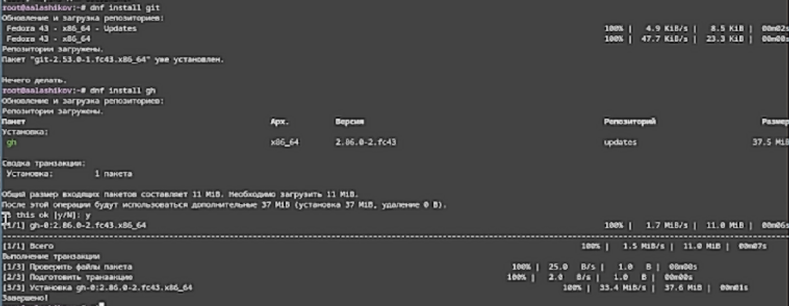
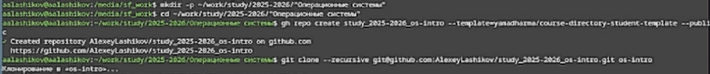
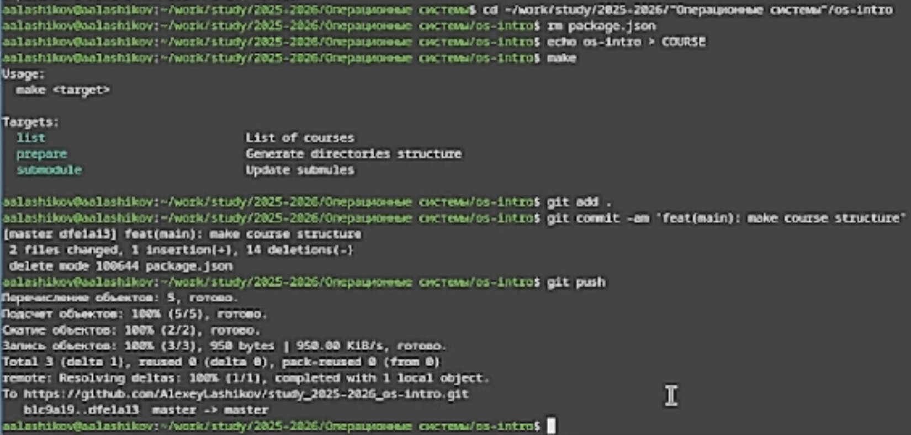

---
## Front matter
lang: ru-RU
title: Лабораторная работа №2
subtitle: Первоначальная настройка git
author:
  - Лащиков Алексей Антонович
institute:
  - Российский университет дружбы народов, Москва, Россия
date: 2026-02-22
date-format: "YYYY-MM-DD"

babel-lang: russian
babel-otherlangs: english

toc: false
slide_level: 2
aspectratio: 169
section-titles: false
theme: metropolis

pdf-engine: xelatex
header-includes:
  - \metroset{progressbar=frametitle,sectionpage=none,numbering=fraction}
  - \usepackage{fontspec}
  - \usepackage{polyglossia}
  - \setdefaultlanguage{russian}
  - \setotherlanguage{english}
  - \defaultfontfeatures{Ligatures=TeX}
  - \setsansfont{DejaVu Sans}
  - \setmainfont{DejaVu Serif}
  - \setmonofont{DejaVu Sans Mono}
---

# Информация

## Докладчик
:::::::::::::: {.columns align=center}
::: {.column width="70%"}
  * Лащиков Алексей Антонович
  * НКАбд-04-25
  * Российский университет дружбы народов
  * [1032253527@rudn.ru](mailto:1032253527@rudn.ru)
:::
::: {.column width="30%"}
:::
::::::::::::::

## Цель и задачи
**Цель:** Изучить идеологию и применение средств контроля версий.

**Задачи:**

- Создать базовую конфигурацию для работы с git.
- Создать ключ SSH.
- Создать ключ PGP.
- Настроить подписи git.
- Зарегистрироваться на GitHub.
- Создать локальный каталог для выполнения заданий по предмету.

# Ход работы

## 1) Установка git и gh

Установил git и GitHub CLI gh.

{#fig-001 width=80%}

## 2) Базовая настройка git

Задал имя и email, настроил начальную ветку и параметры CRLF.

{#fig-002 width=80%}

## 3) SSH-ключ для доступа к репозиториям

Создал SSH-ключ.

{#fig-003 width=60%}

## 4) GPG-ключ и подпись коммитов

Создал GPG-ключ и подготовил его для использования в GitHub.

{#fig-005 width=30%}

## 5) Добавление GPG-ключа в GitHub

Ключ добавлен в настройки GitHub.

{#fig-009 width=80%}

## 6) Автоподпись коммитов

Настроил git на автоматическую подпись коммитов.

{#fig-010 width=80%}

## 7) Автоподпись gh

Выполнил вход в GitHub через `gh auth login`.

{#fig-011 width=80%}

## 8) Репозиторий курса и структура каталога

Создал репозиторий по шаблону и подготовил структуру, затем отправил изменения на сервер.

{#fig-012 width=40%}

{#fig-013 width=40%}

# Итоги

## Выводы
- Выполнена базовая конфигурация `git` для работы.
- Сгенерированы и настроены ключи SSH и GPG.
- Настроены GitHub и gh, включена автоподпись коммитов.
- Создан репозиторий курса по шаблону и подготовлена структура каталога.
