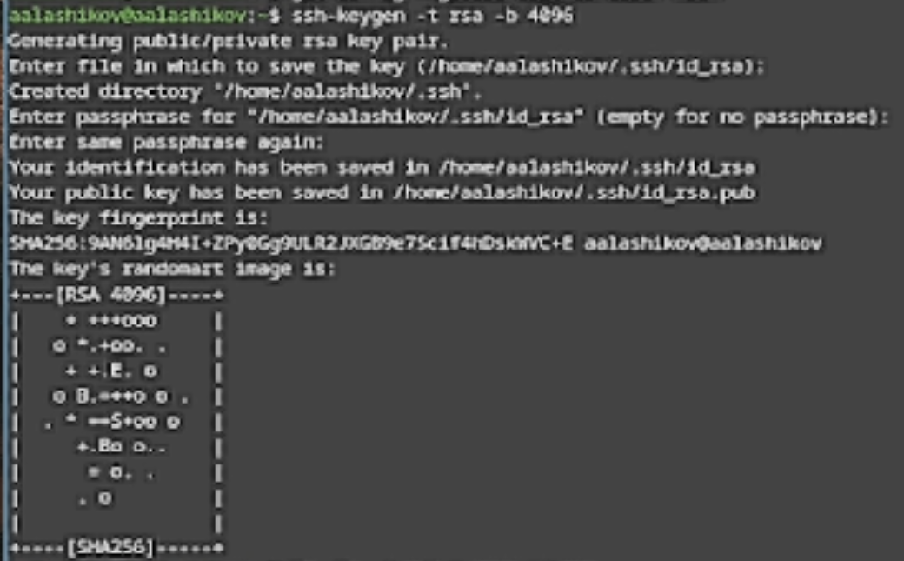
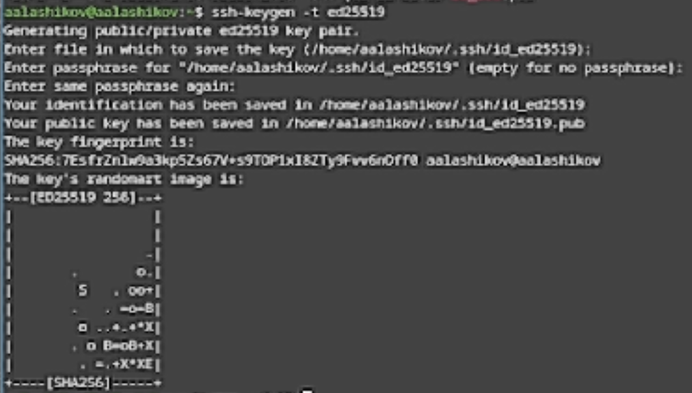
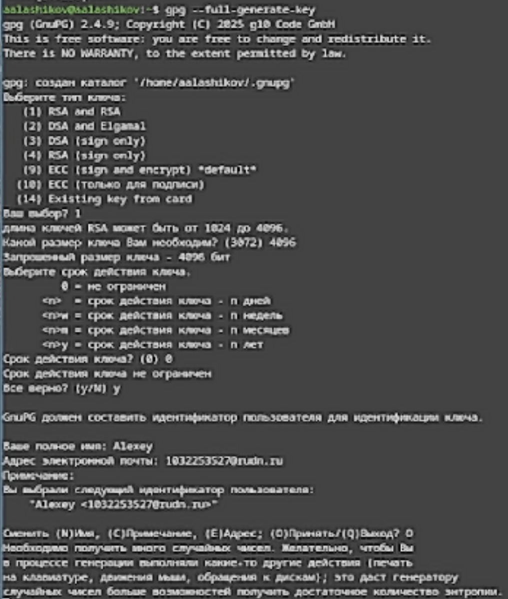
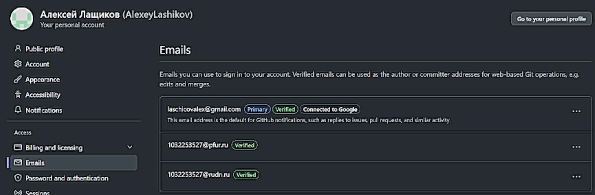
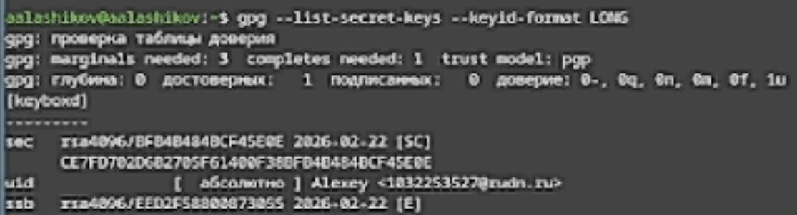
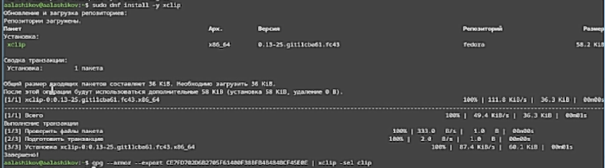
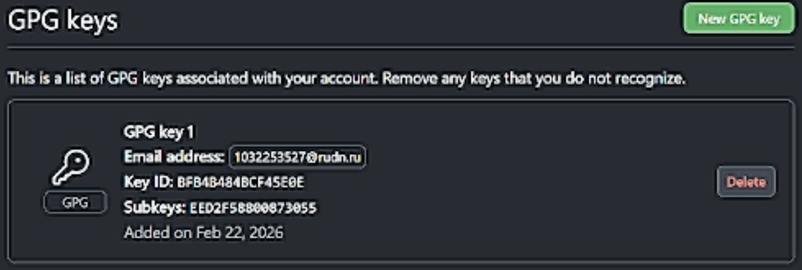
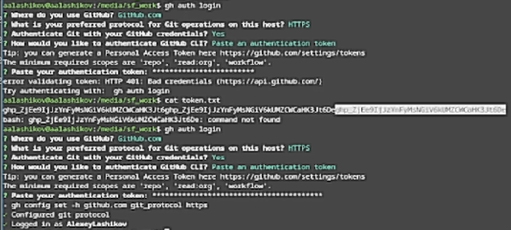

# Цель работы

Цель данной лабораторной работы --- изучить идеологию и применение средств контроля версий и освоить умения по работе с git.

# Задание

- Создать базовую конфигурацию для работы с git.
- Создать ключ SSH.
- Cоздать ключ PGP.
- Настроить подписи git.
- Зарегистрироваться на Github.
- Создать локальный каталог для выполнения заданий по предмету.

# Теоретическое введение

Системы контроля версий нужны, чтобы хранить историю изменений проекта, откатываться к прошлым версиям легко и удобно работать в команде. Git - распределённая VCS: история хранится локально, а синхронизация с GitHub делается через push/pull. Доступ к репозиторию защищают SSH-ключи, а авторство коммитов подтверждают PGP-подписи.

# Выполнение лабораторной работы

## Установка программного обеспечения

Установил git и gh (см. [рис.1](#fig-001)).

{#fig-001 width=70%}

## Базовая настройка git

Задал имя и email владельца репозитория, задал имя начальной ветки, настроил autocrlf и safecrlf (см. [рис.2](#fig-002)).

{#fig-002 width=70%}

## Создание SSH ключа

- по алгоритму rsa с ключём размером 4096 бит (см. [рис.3](#fig-003)).

{#fig-003 width=70%}

- по алгоритму ed25519 (см. [рис.4](#fig-004)).

{#fig-004 width=70%}

## Создание ключа PGP

Создал ключ PGP (см. [рис.5](#fig-005)).

{#fig-005 width=70%}

## Настройка GitHub

В моём случае учётная запись на GitHub с основными данными уже была создана (см. [рис.6](#fig-006)).

{#fig-006 width=70%}

## Добавление GPG ключа в GitHub

Вывел список ключей (см. [рис.7](#fig-007)).

{#fig-007 width=70%}

Установил xclip и скопировал сгенерированный GPG ключ в буфер обмена (см. [рис.8](#fig-008)).

{#fig-008 width=70%}

Перешёл в настройки GitHub, нажал на кнопку New GPG key и вставил полученный ключ в поле ввода (см. [рис.9](#fig-009)).

{#fig-009 width=70%}

## Настройка автоматических подписей коммитов git

Используя введённый email, указал Git применять его при подписи коммитов (см. [рис.10](#fig-010)).

{#fig-010 width=70%}

## Настройка gh

Авторизация `gh auth login` (см. [рис.11](#fig-011)).

{#fig-011 width=70%}

## Создание репозитория курса на основе шаблона

Создал репозиторий курса на основе шаблона (см. [рис.12](#fig-012)).

{#fig-012 width=70%}

## Настройка каталога курса

Перешёл в каталог курса, удалил лишние файлы, создал необходимые каталоги и отправил данные на сервер (см. [рис.13](#fig-013)).

{#fig-013 width=70%}

# Контрольные вопросы

1. VCS --- инструмент для хранения и управления изменениями файлов проекта. Нужно для ведения истории, отката к прошлым состояниям, совместной работы, контроля кто, когда и что изменил и для безопасного объединения правок.
2. Объяснение понятий VCS:

- Хранилище --- место, где хранится проект и его история.
- commit --- зафиксированный снимок изменений с сообщением, автором и временем.
- история --- цепочка коммитов, показывающая развитие проекта.

3. Централизованные и децентрализованные VCS и их примеры:

- Централизованные: один главный сервер, все работают через него (пример: SVN/Subversion, CVS).
- Децентрализованные: у каждого участника полная копия истории, сервер необязателен (пример: Git, Mercurial, Bazaar).

4. Действия с VCS при единоличной работе:
Инициализировать репозиторий (`git init`), редактировать файлы, добавлять в индекс (`git add`), фиксировать (`git commit`), смотреть статус и историю (`git status`, `git log`), при необходимости можно откатываться (`git checkout`, `git reset`).

5. Порядок работы с общим хранилищем VCS:
Клонировать проект (`git clone`), перед началом работы забрать обновления (`git pull`), создать ветку под задачу (опционально), внести изменения, `git add`, `git commit`, отправить на сервер (`git push`), при конфликтах --- решить и повторить `push/merge`.

6. Основные задачи, решаемые git:
Учёт изменений и история, ветвление и слияние, параллельная разработка, синхронизация с удалёнными репозиториями, контроль  конфликтов, быстрый откат к нужной версии, резервное хранение истории.

7. Команды git:

- `git init` --- создать локальный репозиторий;
- `git pull` --- скачать изменения с удалённого репозитория и слить в текущую папку;
- `git push` --- отправить коммиты на удалённый репозиторий;
- `git status` --- показать, какие файлы изменены, добавлены, неотслеживаюся;
- `git diff` --- показать разницу;
- `git add .` --- добавить все изменения в индекс;
- `git add file_names` --- добавить конкретные файлы в индекс;
- `git rm file_names` --- удалить файлы из репозитория и проиндексировать удаление;
- `git commit -am 'Commit description'` --- закоммитить уже отслеживаемые файлы;
- `git commit` --- создать коммит;
- `git checkout -b branch_name` --- создать новую ветку и перейти на неё;
- `git checkout branch_name` --- перейти на существующую ветку;
- `git push origin branch_name` --- отправить конкретную ветку на origin;
- `git merge --no-ff branch_name` --- слить ветку в текущую, сохранив отдельный merge-коммит;
- `gir branch -d branch_name` --- удалить локальную ветку;
- `git branch -D branch_name` --- удалить локальную ветку принудительно;
- `git push origin: branch_name` --- удалить ветку на удалённом репозитории; 

8. Примеры работы с локальным и удалённым репозиторием:

- Локально: `git init`, `git add .`, `git commit -m "msg"`, `git log`.
- Удалённо: `git clone <url>`, `git pull`, `git push`, `git remove -v`.

9. Ветка --- отдельная линия разработки в репозитории. Нужна, чтобы делать новую функцию, исправление или эксперемент, не ломая основную ветку, а потом аккуратно слить результат обратно.

10. Ненужные файлы можно добавлять в `.gitignore`, чтобы Git не предлагал их коммитить.

# Выводы

В ходе данной лабораторной работы я изучил идеологию и применение средств контроля версий и освоил умения по работе с git.
