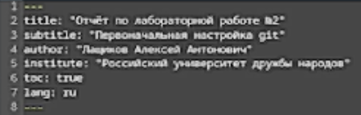
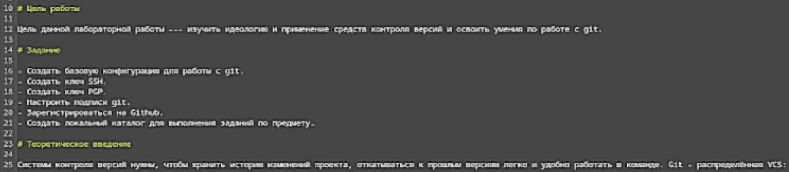
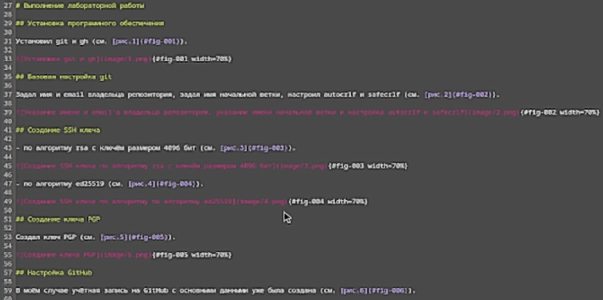
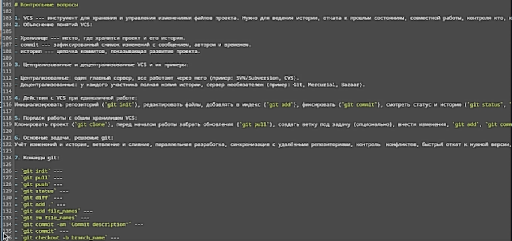
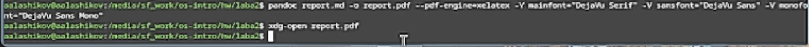

---
## Front matter
lang: ru-RU
title: Лабораторная работа №3
subtitle: Markdown
author:
  - Лащиков Алексей Антонович
institute:
  - Российский университет дружбы народов, Москва, Россия
date: 2026-02-26
date-format: "YYYY-MM-DD"

babel-lang: russian
babel-otherlangs: english

toc: false
slide_level: 2
aspectratio: 169
section-titles: false
theme: metropolis

pdf-engine: xelatex
header-includes:
  - \metroset{progressbar=frametitle,sectionpage=none,numbering=fraction}
  - \usepackage{fontspec}
  - \usepackage{polyglossia}
  - \setdefaultlanguage{russian}
  - \setotherlanguage{english}
  - \defaultfontfeatures{Ligatures=TeX}
  - \setsansfont{DejaVu Sans}
  - \setmainfont{DejaVu Serif}
  - \setmonofont{DejaVu Sans Mono}
---

# Информация

## Докладчик
:::::::::::::: {.columns align=center}
::: {.column width="70%"}
  * Лащиков Алексей Антонович
  * НКАбд-04-25
  * Российский университет дружбы народов
  * [1032253527@rudn.ru](mailto:1032253527@rudn.ru)
:::
::: {.column width="30%"}
:::
::::::::::::::

## Цель и задачи
**Цель:** научиться оформлять отчёты с помощью языка разметки Markdown.

**Задачи:**
- сделать отчёт по предыдущей лабораторной работе в формате Markdown;
- подготовить отчёт в трёх форматах: `md`, `pdf`, `docx`.

# Коротко о Markdown

## Что такое Markdown

- лёгкий язык разметки для оформления текста;
- быстро пишется в любом редакторе;
- удобно хранить Git и конвертировать в другие форматы.

## Базовый синтаксис

- заголовки: `#`, `##`, `###`
- выделение: `**bold**`, `*italic*`, `***оба***`
- списки:
	- `- пункт`
	- `1. пункт`
- ссылки: `[текст](url)`
- цитаты: `> цитата`
- код: `` `inline` `` и блоки ``` ```

## Формулы и ссылки на формулы
- внутритекстовая формула: `$\sin^2 x + \cos^2 x = 1$`
- выключная формула:
```
$$
\sin^2 x + \cos^2 x = 1
$$ {#eq:eq:sin2+cos2}
```

* ссылка в тексте: `Смотри формулу ([-@eq:eq:sin2+cos2])`

# Конвертация отчёта

## Pandoc и фильтры

Для преобразования Markdown в другие форматы используется **Pandoc**.

* `pandoc` - конвертер;
* `pandoc-crossref` - перекрёстные ссылки (рисунки, таблицы, формулы);
* `pandoc-citeproc` - обработка цитирований.

## Примеры команд

В PDF:

```
pandoc README.md -o README.pdf
```

B DOCX:

```
pandoc README.md -o README.docx
```

# Выполнение лабораторной работы

## Структура отчёта

Оформил титульные данные и основную информацию отчёта (см. [рис.1](#fig-001)).

{#fig-001 width=85%}

## Цель, задание, теория

Добавил цель, задание и теоретическое введение (см. [рис.2](#fig-002)).

{#fig-002 width=85%}

## Описание выполнения

Описал процесс выполнения лабораторной работы (см. [рис.3](#fig-003)).

{#fig-003 width=85%}

## Контрольные вопросы и выводы

Ответил на контрольные вопросы (см. [рис.5](#fig-005)) и сформулировал выводы.

{#fig-005 width=80%}

## Компиляция в PDF

Скомпилировал отчёт в PDF через pandoc (см. [рис.4](#fig-004)).

{#fig-004 width=85%}

# Итоги

## Выводы

В ходе лабораторной работы я освоил оформление отчётов в Markdown и научился преобразовывать документ в форматы `pdf` и `docx` с помощью Pandoc.
