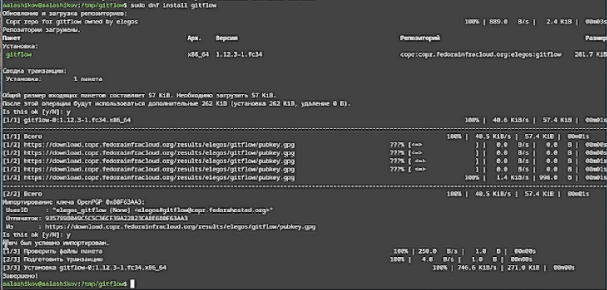
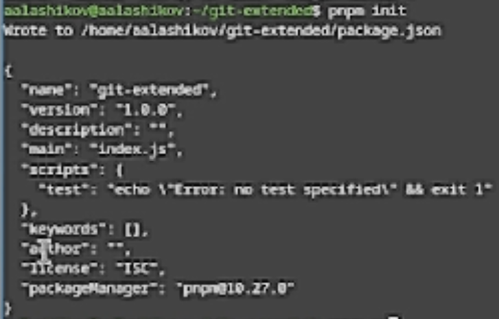
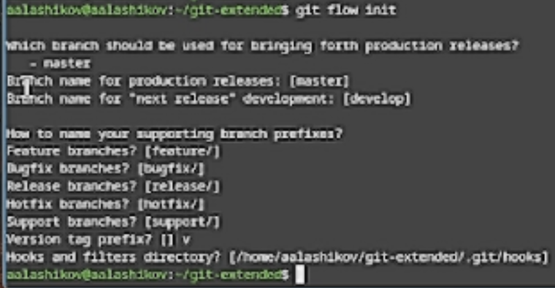
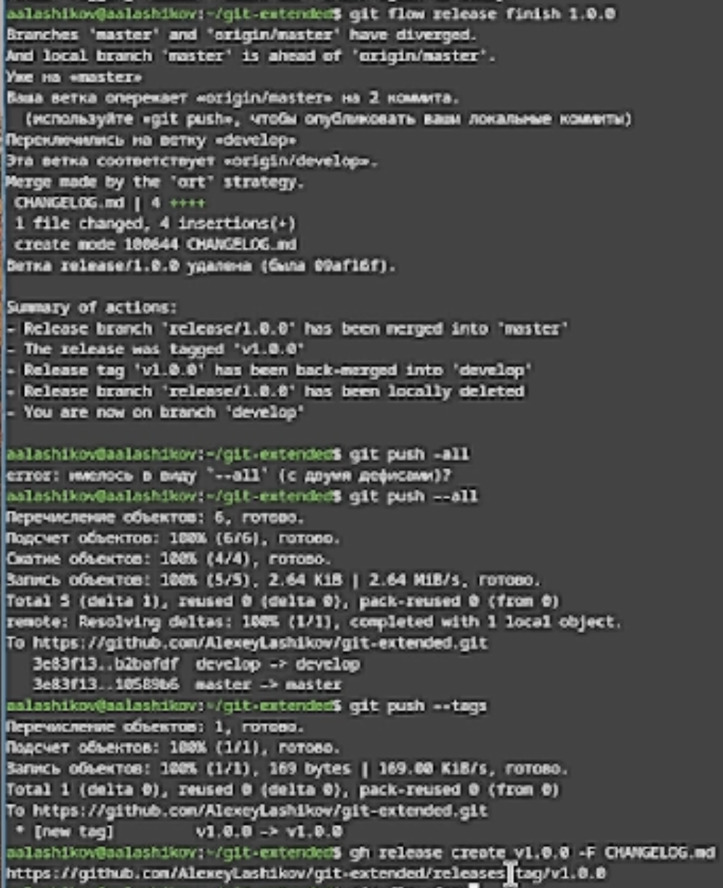
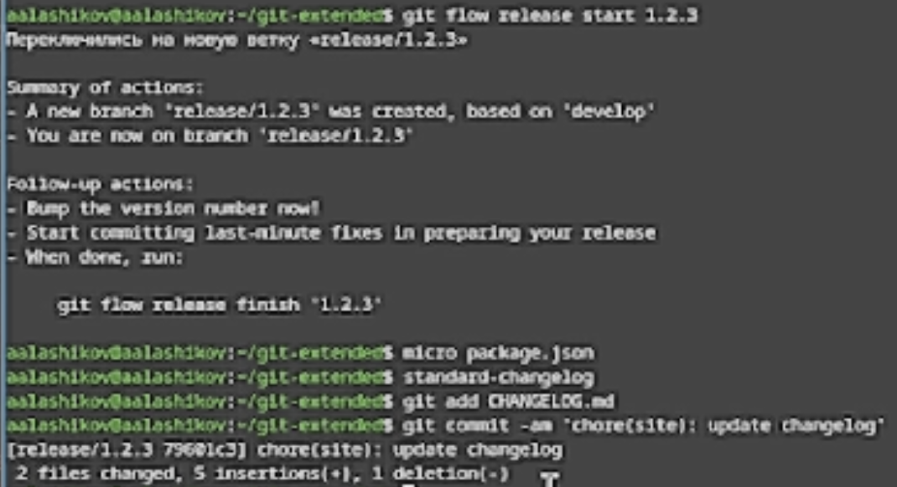
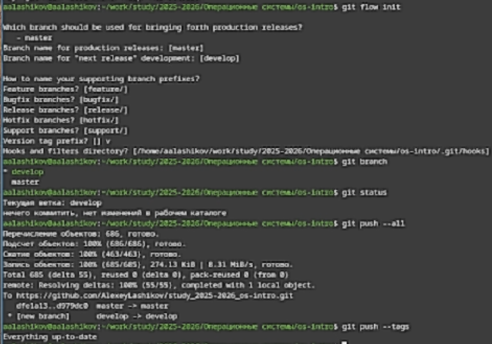

---
## Front matter
lang: ru-RU
title: Лабораторная работа №4
subtitle: Продвинутое использование git
author:
  - Лащиков Алексей Антонович
institute:
  - Российский университет дружбы народов, Москва, Россия
date: 2026-02-28
date-format: "YYYY-MM-DD"

babel-lang: russian
babel-otherlangs: english

toc: false
slide_level: 2
aspectratio: 169
section-titles: false
theme: metropolis

pdf-engine: xelatex
header-includes:
  - \metroset{progressbar=frametitle,sectionpage=none,numbering=fraction}
  - \usepackage{fontspec}
  - \usepackage{polyglossia}
  - \setdefaultlanguage{russian}
  - \setotherlanguage{english}
  - \defaultfontfeatures{Ligatures=TeX}
  - \setsansfont{DejaVu Sans}
  - \setmainfont{DejaVu Serif}
  - \setmonofont{DejaVu Sans Mono}
---

# Докладчик
:::::::::::::: {.columns align=center}
::: {.column width="70%"}
  * Лащиков Алексей Антонович
  * НКАбд-04-25
  * Российский университет дружбы народов
  * [1032253527@rudn.ru](mailto:1032253527@rudn.ru)
:::
::: {.column width="30%"}
:::
::::::::::::::

# Цель и задачи
**Цель:** Получение навыков правильной работы с репозиториями git.

**Задачи:**

- Выполнить работу для тестового репозитория.
- Преобразовать рабочий репозиторий в репозиторий с git-flow и conventional commits.

# Gitflow: идея

Gitflow --- модель ветвления для проектов, где важны релизы и версия.

- master --- официальная история релизов (теги версий)
- develop --- интеграционная ветка разработки
- feature/* --- разработка новых функций
- release/* --- подготовка релиза
- hotfix/* --- срочные исправления из master

# Gitflow: базовые команды

Инициализация:
```
git flow init
git branch
```

Feature:
```
git flow feature start feature_branch
git flow feature finish feature_branch
```

Release:
```
git flow release start 1.0.0
git flow release finish 1.0.0
```

# Conventional Commits

Conventional Commits --- соглашение о сообщениях коммитов, чтобы:

- проще понимать историю;
- автоматически строить CHANGELOG;
- увязать коммиты с SemVer.

# Conventional Commits: формат

Структура:
```
<type>(<scope>): <subject>

<body>

<footer>
```

Примеры типов:

- `fix:` — коммит типа fix исправляет ошибку в вашем коде.
- `feat:` — коммит типа feat добавляет новую функцию в ваш код.
- `BREAKING CHANGE:` — коммит, который добавляет изменения, нарушающие обратную совместимость вашего API.
- также часто: `docs:`, `chore:`, `refactor:`, `test:`.

# Ход работы

В работе я собрал тестовый репозиторий и перевёл его на связку gitflow и conventional commits, чтобы получить релизный процесс: отдельные ветки под разработку релизы, теги версий и автоматический CHANGELOG.

# Подготовка окружения

Сначала установил нужные инструменты: git-flow для модели ветвления и Node.js + pnpm для утилит, связанных с conventional commits и журналом изменений (см. [рис.1](#fig-001)).

{#fig-001 width=70%}

# Настройка коммитов и журнала изменений

Дальше настроил:

- commitizen для удобного ввода сообщений коммитов по Conventional Commits,
- standard-changelog для генерации CHANGELOG.md на основе истории коммитов.

{#fig-002 width=30%}

# Gitflow в репозитории

После этого инициализировал git-flow и привёл репозиторий к схеме master/develop, чтобы дальше делать релизы.

{#fig-011 width=60%}

# Релизы и публикация

Затем выполнил релизный цикл:

Cоздание release-ветки, обновление CHANGELOG, завершение релиза, пуш веток и тегов, релиз на GitHub.

{#fig-014 width=25%}

# Проверка рабочего сценария

В конце прогнал типовой процесс:

Работа через feature-ветку и выпуск следующей версии.

{#fig-016 width=60%}

# Преобразование рабочего репозитория

По заданию преобразовал основной репозиторий для загрузки лабораторных работ в репозиторий с git-flow и conventional commits.

{#fig-015 width=40%}

# Выводы

В ходе данной лабораторной работы я:

- Разобрал модель Gitflow и назначение веток master, develop, feature, release, hotfix.
- Настроил conventional commits и генерацию CHANGELOG.
- Выполнил практический сценарий с релизами и тегами.
- Перенёс рабочий репозиторий в формат git-flow и conventional commits.
