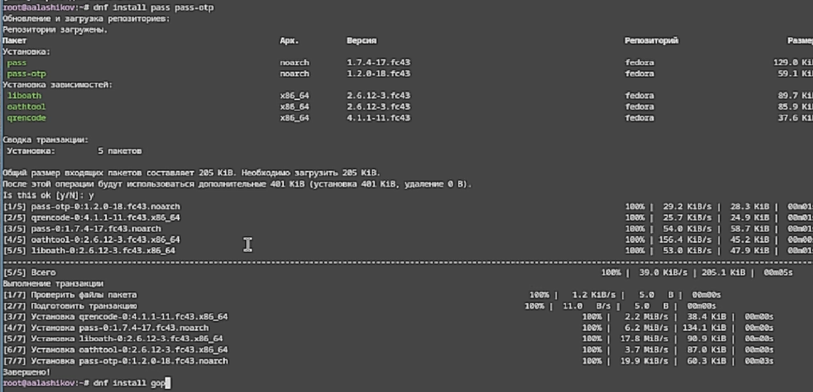
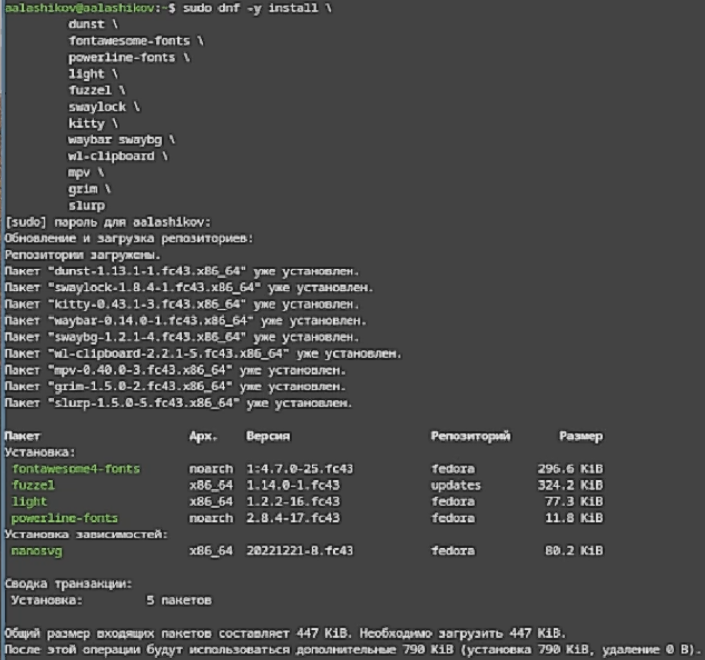
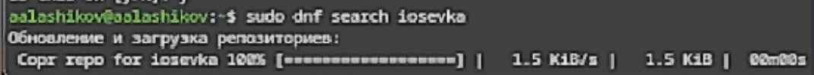
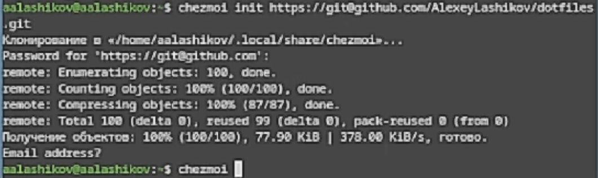

---
## Author
author:
  name: Лащиков Алексей Антонович
  email: "1032253527@rudn.ru"
  affiliation:
    - name: Российский университет дружбы народов
      country: Российская Федерация
      postal-code: 117198
      city: Москва
      address: ул. Миклухо-Маклая, д. 6

## Title
title: "Лабораторная работа №5"
subtitle: "Менеджер паролей pass и управление файлами конфигурации с помощью chezmoi"
license: "CC BY"

toc: true
toc-title: "Содержание"
number-sections: true

crossref:
  fig-title: "Рисунок"
  tbl-title: "Таблица"
  sec-prefix: "Раздел"
  fig-prefix: "Рис."
  tbl-prefix: "Табл."

format:
  pdf:
    pdf-engine: xelatex
    documentclass: article
    fontsize: 12pt
    linestretch: 1.2
    geometry: margin=2.5cm
    mainfont: "Times New Roman"
    sansfont: "Arial"
    monofont: "Consolas"
    include-in-header:
      text: |
        \usepackage{polyglossia}
        \setdefaultlanguage{russian}
        \usepackage{csquotes}
        \usepackage{caption}
        \captionsetup[figure]{name=Рисунок}
        \captionsetup[table]{name=Таблица}

  docx:
    toc: true

execute:
  echo: true
  warning: false
  error: false
---

# Цель работы

Цель данной лабораторной работы --- знакомство с менеджером паролей `pass`, изучение принципов хранения и организации базы паролей, а также освоение утилиты `chezmoi` для управления конфигурационными файлами и настройки рабочей среды на нескольких машинах.

# Задание

- Изучить основные свойства менеджера паролей `pass`.
- Рассмотреть структуру и семантическую организацию базы паролей.
- Ознакомится с реализациями и интерфейсами для работы с `pass`.
- Установить и настроить `pass`.
- Настроить взаимодействие `pass` с браузеромю
- Установить и настроить `chezmoi`.
- Создать собственный репозиторий конфигурационных файлов.
- Освоить использование `chezmoi` на нескольких машинах.

# Теоретическое введение

## Менеджер паролей pass

Менеджер паролей pass — это программа, выполненная в рамках идеологии Unix. Также её называют стандартным менеджером паролей для Unix.

### Основные свойства

- данные хранятся в файловой системе в виде каталогов и файлов;
- файлы шифруются с помощью GPG-ключа;
- хранилище имеет простую и прозрачную структуру;
- возможна синхронизация с git-репозиторием;
- программу можно использовать как напрямую из терминала, так и через дополнительные интерфейсы.

### Структура базы паролей

Структура базы паролей может быть произвольной, если пользователь работает с ней напрямую, без промежуточного программного обеспечения. В этом случае смысл организации файлов пользователь определяет самостоятельно.

Если же требуется использование дополнительного программного обеспечения, например браузерного расширения или графического интерфейса, то семантика должна быть заложена в структуру базы паролей.

### Семантическая структура базы паролей

Для пользователя user в домене example.com и на порту 22 могут использоваться различные варианты именования файлов.

Если имя пользователя или порт не указаны, считается, что совпадение возможно с любым именем пользователя и портом:

```
example.com.pgp
```

Имя пользователя может быть оформлено как имя файла внутри каталога хоста:

```text
example.com/user.pgp
```

Имя пользователя также может быть указано как префикс перед именем хоста:

```
user@example.com.pgp
```

Порт может задаваться после имени хоста через двоеточие:

```
example.com:22.pgp
example.com:22/user.pgp
user@example.com:22.pgp
```

Все такие записи могут находиться в произвольных каталогах, задающих пользовательскую иерархию.

## Реализации

### Утилиты командной строки

Существует две основные реализации:

* pass — классическая реализация в виде shell-скриптов;
* gopass — реализация на языке Go с дополнительными встроенными возможностями.

В данной лабораторной работе используется программа pass, однако аналогичные действия можно выполнить и при помощи gopass.

### Графические интерфейсы

Для работы с хранилищем паролей существуют графические интерфейсы:

* qtpass — может использоваться как графический интерфейс к pass или как самостоятельная программа;
* gopass-ui — графический интерфейс к gopass;
* webpass — веб-интерфейс к pass.

### Приложения для Android

Для Android существуют приложения:

* Password Store — приложение для работы с хранилищем паролей и синхронизации через git;
* OpenKeychain: Easy PGP — приложение для управления PGP-ключами.

### Пакеты для Emacs

Для Emacs существуют пакеты:

* pass — основной режим для управления хранилищем и редактирования записей;
* helm-pass — интерфейс на базе helm;
* ivy-pass — интерфейс на базе ivy.

# Выполнение лабораторной работы

## Менеджер паролей pass

### Установка

Установил `pass` (см. [рис.1](#fig-001)).

{#fig-001 width=70%}

Установил `gopass` (см. [рис.2](#fig-002)).

{#fig-002 width=70%}

### Настройка

Просмотрел список ключей, нашёл действующий ключ (см. [рис.3](#fig-003)).

{#fig-003 width=70%}

Инициализировал хранилище (см. [рис.4](#fig-004)).

{#fig-004 width=70%}

Создал структуру git (см. [рис.5](#fig-005)).

{#fig-005 width=70%}

Задал адрес репозитория на хостинге (см. [рис.6](#fig-006)).

{#fig-006 width=70%}

Настроил интерфейс для взаимодействия с браузером (см. [рис.7](#fig-007)).

{#fig-007 width=70%}

### Сохранение пароля

Добавил новый пароль (см. [рис.8](#fig-008)).

{#fig-008 width=70%}

### Дополнительное программное обеспечение

Установил дополнительное программное обеспечение (см. [рис.9](#fig-009)).

{#fig-009 width=70%}

Установил шрифты (см. [рис.10](#fig-010)).

{#fig-010 width=70%}

Установил бинарный файл (см. [рис.11](#fig-011)).

{#fig-011 width=70%}

Создал собственный репозиторий с помощью утилит (см. [рис.12](#fig-012)).

{#fig-012 width=70%}

Подключил репозиторий к своей системе (см. [рис.13](#fig-013)).

{#fig-013 width=70%}

На второй машине инициализировал `chezmoi` с моим репозиторием `dotfiles` (см. [рис.14](#fig-014)).

{#fig-014 width=70%}

Добавил в файл конфигурации `~/.config/chezmoi/chezmoi.toml` autoCommit и autoPush (см. [рис.15](#fig-015)).

{#fig-015 width=70%}

# Выводы

В ходе выполнения лабораторной работы был изучен менеджер паролей pass, его структура, способы хранения данных и возможности интеграции с различными интерфейсами. Были получены практические навыки установки, настройки и использования pass, а также сохранения паролей в зашифрованном хранилище.

Кроме того, была освоена утилита chezmoi для управления файлами конфигурации. Были изучены шаблоны, механизм инициализации, подключение удалённого репозитория, применение конфигурации на нескольких машинах и настройка рабочей среды. В результате работы были получены навыки централизованного хранения и переноса пользовательских настроек между различными системами.

---
lang: ru-RU
title: "Лабораторная работа №5"
subtitle: "Менеджер паролей pass и управление файлами конфигурации с помощью chezmoi"
author: "Лащиков Алексей Антонович"
institute: "Российский университет дружбы народов, Москва, Россия"
date: 2026-03-08
date-format: "YYYY-MM-DD"

toc: false
section-titles: false

format:
  revealjs:
    theme: night
    slide-number: true
    hash: true
    transition: slide
    center: false
    navigation-mode: linear
    width: 1920
    height: 1200
    margin: 0.2

  beamer:
    theme: metropolis
    colortheme: default
    aspectratio: 169
    pdf-engine: xelatex
    include-in-header:
      - text: |
          \metroset{progressbar=frametitle,sectionpage=none,numbering=fraction}
          \usepackage{fontspec}
          \usepackage{polyglossia}
          \setdefaultlanguage{russian}
          \setotherlanguage{english}
          \defaultfontfeatures{Ligatures=TeX}
          \setsansfont{Segoe UI}
          \setmainfont{Times New Roman}
          \setmonofont{Consolas}
          \usepackage{graphicx}
          \setkeys{Gin}{keepaspectratio}
---

# Докладчик

:::::::::::::: {.columns align=center}
::: {.column width="70%"}

  * Лащиков Алексей Антонович
  * Студент группы НКАбд-04-25
  * Российский университет дружбы народов им. П. Лумумбы
  * [1032253527@rudn.ru](mailto:1032253527@rudn.ru)
  * <https://alexeylashikov.github.io/>

:::
::: {.column width="30%"}


:::
::::::::::::::

# Цель и задачи

**Цель:** изучить менеджер паролей `pass` и освоить утилиту `chezmoi` для управления конфигурационными файлами и их переноса между машинами.

**Задачи:**

- рассмотреть свойства и структуру `pass`;
- установить и настроить `pass`;
- подключить работу с браузером;
- изучить возможности `chezmoi` и шаблонов;
- создать и подключить репозиторий `dotfiles`;
- проверить перенос конфигурации на другую машину.

# Менеджер паролей pass

`pass` — стандартный Unix-менеджер паролей. Он хранит записи в виде обычных файлов и каталогов, а каждая запись шифруется при помощи GPG.

**Основные свойства:**

- простая файловая организация;
- шифрование на уровне отдельных записей;
- удобная работа из терминала;
- возможность синхронизации через `git`;
- совместимость с дополнительными интерфейсами.

# Структура базы паролей

Семантика записей в `pass` задаётся именами файлов и каталогов.

Примеры структуры:

```text
example.com.pgp
example.com/user.pgp
user@example.com.pgp
example.com:22.pgp
example.com:22/user.pgp
user@example.com:22.pgp
```

Такая схема позволяет кодировать в имени записи хост, пользователя и порт.

# Дополнительные интерфейсы

Кроме консольной утилиты, для `pass` существуют и другие варианты работы:

- `gopass` — альтернативная реализация на Go;
- `qtpass`, `gopass-ui`, `webpass` — графические интерфейсы;
- `Password Store`, `OpenKeychain` — Android-приложения;
- `pass`, `helm-pass`, `ivy-pass` — пакеты для Emacs.

Это делает систему удобной как для терминальной работы, так и для повседневного использования.

# Управление файлами конфигурации

Для работы с конфигурационными файлами использовалась утилита `chezmoi`.

Она позволяет:

- хранить `dotfiles` в отдельном репозитории;
- применять одинаковую конфигурацию на разных машинах;
- использовать шаблоны для различающихся параметров;
- автоматически синхронизировать изменения.

Рабочее состояние хранится в каталоге `~/.local/share/chezmoi`, а локальные параметры машины — в `~/.config/chezmoi/chezmoi.toml`.

# Шаблоны в chezmoi

`chezmoi` поддерживает шаблоны на основе синтаксиса Go.

**Основные возможности шаблонов:**

- использование переменных, например `{{ .chezmoi.hostname }}`;
- условные конструкции `if / else / end`;
- генерация разных версий файла для разных машин;
- проверка шаблонов через `chezmoi execute-template`.

Это удобно для настройки рабочей среды, когда часть конфигурации общая, а часть зависит от конкретной системы.

# Установка pass

На первом этапе установил менеджеры паролей `pass` и `gopass`, после чего подготовил среду для дальнейшей настройки (@fig-001, @fig-002).

:::::::::::::: {.columns align=center}
::: {.column width="50%"}

{#fig-001 width=100%}

:::
::: {.column width="50%"}

{#fig-002 width=100%}

:::
::::::::::::::

# GPG и инициализация хранилища

Далее проверил наличие секретных GPG-ключей, так как без них невозможно безопасно шифровать записи. После этого инициализировал хранилище `pass`, указав идентификатор ключа (@fig-003, @fig-004).

:::::::::::::: {.columns align=center}
::: {.column width="50%"}

{#fig-003 width=100%}

:::
::: {.column width="50%"}

{#fig-004 width=100%}

:::
::::::::::::::

# Подключение git к pass

После создания хранилища настроил его синхронизацию через `git`: инициализировал репозиторий и задал удалённый адрес. Такая настройка нужна для резервного копирования и переноса базы паролей между устройствами (@fig-005, @fig-006).

:::::::::::::: {.columns align=center}
::: {.column width="50%"}

{#fig-005 width=100%}

:::
::: {.column width="50%"}

{#fig-006 width=100%}

:::
::::::::::::::

# Интеграция с браузером и сохранение пароля

Затем настроил интерфейс взаимодействия с браузером через `browserpass`, чтобы использовать записи из хранилища при авторизации на сайтах. После этого добавил новую запись в хранилище и проверил, что пароль корректно сохраняется (@fig-007, @fig-008).

:::::::::::::: {.columns align=center}
::: {.column width="50%"}

{#fig-007 width=100%}

:::
::: {.column width="50%"}

{#fig-008 width=100%}

:::
::::::::::::::

# Подготовка среды для chezmoi

Для настройки пользовательского окружения установил дополнительное программное обеспечение и необходимые шрифты. Это подготовило рабочую среду для дальнейшего применения конфигурационных файлов через `chezmoi` (@fig-009, @fig-010).

:::::::::::::: {.columns align=center}
::: {.column width="50%"}

{#fig-009 width=100%}

:::
::: {.column width="50%"}

{#fig-010 width=100%}

:::
::::::::::::::

# Установка chezmoi и создание dotfiles-репозитория

Следующим шагом установил бинарный файл `chezmoi`, а затем создал собственный репозиторий `dotfiles` с помощью утилит командной строки. Это стало основой для хранения конфигурации в отдельном git-репозитории (@fig-011, @fig-012).

:::::::::::::: {.columns align=center}
::: {.column width="50%"}

{#fig-011 width=100%}

:::
::: {.column width="50%"}

{#fig-012 width=100%}

:::
::::::::::::::

# Подключение репозитория и применение конфигурации

После создания репозитория подключил его к текущей системе через `chezmoi init`, проверил различия командой `chezmoi diff` и применил изменения в домашний каталог. Так конфигурация начала управляться централизованно (@fig-013).

{#fig-013 width=78%}

# Использование на нескольких машинах

Затем выполнил инициализацию `chezmoi` на другой машине с тем же репозиторием `dotfiles`. Такой подход позволяет быстро восстановить рабочую среду и получить одинаковую конфигурацию на нескольких устройствах (@fig-014).

{#fig-014 width=78%}

# Автоматизация синхронизации

В завершение настроил параметры `autoCommit` и `autoPush` в файле `~/.config/chezmoi/chezmoi.toml`. Благодаря этому изменения в исходном каталоге могут автоматически фиксироваться и отправляться в удалённый репозиторий (@fig-015).

{#fig-015 width=78%}

# Выводы

В результате выполнения лабораторной работы были получены практические навыки работы с двумя важными инструментами пользовательской среды Linux.

`pass` позволил изучить безопасное хранение паролей в зашифрованном виде с простой файловой структурой и возможностью синхронизации через `git`. `chezmoi` показал удобный способ централизованного управления конфигурационными файлами, использования шаблонов и переноса настроек между машинами.

Таким образом, лабораторная работа продемонстрировала, как можно организовать безопасное хранение секретов и одновременно упростить настройку рабочей среды.