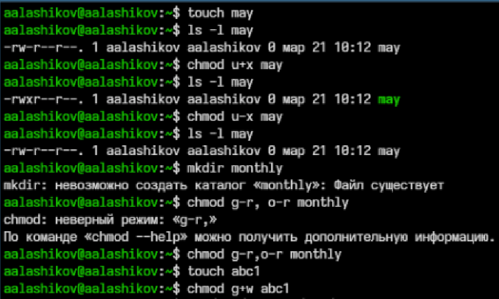
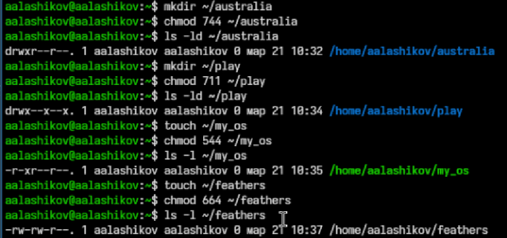
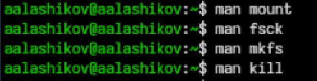

---
## Author
author:
  name: Лащиков Алексей Антонович
  email: "1032253527@rudn.ru"
  affiliation:
    - name: Российский университет дружбы народов
      country: Российская Федерация
      postal-code: 117198
      city: Москва
      address: ул. Миклухо-Маклая, д. 6

## Title
title: "Лабораторная работа №7"
subtitle: "Анализ файловой системы Linux. Команды для работы с файлами и каталогами"
license: "CC BY"

toc: true
toc-title: "Содержание"
number-sections: true

crossref:
  fig-title: "Рисунок"
  tbl-title: "Таблица"
  sec-prefix: "Раздел"
  fig-prefix: "Рис."
  tbl-prefix: "Табл."

format:
  pdf:
    pdf-engine: xelatex
    documentclass: article
    fontsize: 12pt
    linestretch: 1.2
    geometry: margin=2.5cm
    mainfont: "Times New Roman"
    sansfont: "Arial"
    monofont: "Consolas"
    include-in-header:
      text: |
        \usepackage{polyglossia}
        \setdefaultlanguage{russian}
        \usepackage{csquotes}
        \usepackage{caption}
        \captionsetup[figure]{name=Рисунок}
        \captionsetup[table]{name=Таблица}

  docx:
    toc: true

execute:
  echo: true
  warning: false
  error: false
---

# Цель работы

Цель данной лабораторной работы --- ознакомиться со структурой файловой системы Linux, приобрести практические навыки работы с файлами и каталогами, изучить способы изменения прав доступа, а также научиться использовать команды анализа и обслуживания файловой системы.

# Задание

1. Выполнить все примеры, приведённые в первой части описания лабораторной работы.
2. Выполнить действия с файлами и каталогами:
  1. Скопировать файл `/usr/include/sys/io.h` в домашний каталог и назвать его `equipment`.
  2. Создать каталог `~/ski.plases`.
  3. Переместить файл `equipment` в каталог `~/ski.plases`.
  4. Переименовать файл `~/ski.plases/equipment` в `~/ski.plases/equiplist`.
  5. Создать файл `~/abc1` и скопировать его в каталог `~/ski.plases` под именем `equiplist2`.
  6. Создать каталог `~/ski.plases/equipment`.
  7. Переместить файлы `equiplist` и `equiplist2` в каталог `~/ski.plases/equipment`.
  8. Создать каталог `~/newdir`, переместить его в `~/ski.plases` и назвать `plans`.
3. Подобрать опции команды `chmod`, чтобы получить заданные права доступа для объектов `australia`, `play`, `my_os`, `feathers`.
4. Выполнить операции с файлами и каталогами, а также исследовать влияние прав доступа.
5. Прочитать `man` по командам `mount`, `fsck`, `mkfs`, `kill` и кратко их охарактеризовать, приведя примеры.

# Теоретическое введение

Файловая система Linux организует хранение данных в виде иерархии каталогов и файлов. Для работы с файлами и каталогами используются команды `touch`, `cat`, `less`, `head`, `tail`, `cp`, `mv`, `mkdir`, `ls` и другие. Для изменения прав доступа применяется команда `chmod`, позволяющая задавать права как в символьной, так и в числовой форме.

Право `r` разрешает чтение файла или просмотр имён объектов в каталоге, право `w` отвечает за запись, а право `x` позволяет выполнять файл как программу или переходить в каталог. Права задаются отдельно для владельца, группы и остальных пользователей.

Для анализа файловой системы Linux применяются команды `mount`, `df`, `lsblk`, `fsck` и `mkfs`. Команда `mount` подключает файловую систему к дереву каталогов, `fsck` проверяет и при необходимости исправляет ошибки файловой системы, `mkfs` создаёт новую файловую систему на разделе, а `kill` используется для отправки сигналов процессам.

# Выполнение лабораторной работы

## Выполнение примеров из первой части описания лабораторной работы

Сначала были выполнены примеры, приведённые в первой части описания лабораторной работы. Для работы с файлами были использованы команды `touch`, `cp`, `mv`, `mkdir`, `ls`, а также команды просмотра содержимого файлов `cat`, `less`, `head`, `tail`. В ходе выполнения примеров был создан файл `abc1`, после чего он был скопирован в файлы `april` и `may`. Затем был создан каталог `monthly`, в который были скопированы файлы `april` и `may` (см. [рис.1](#fig-001)).

{#fig-001 width=75%}

Далее были выполнены примеры, связанные с рекурсивным копированием каталогов и с командой `mv`. Каталог `monthly` был скопирован в `monthly.00`, затем каталог `monthly.00` при необходимости был скопирован в другой каталог. После этого файл `april` был переименован в `july`, перемещён в каталог `monthly.00`, а сам каталог `monthly.00` был переименован в `monthly.01`, затем перемещён в каталог `reports` и переименован в `reports/monthly` (см. [рис.2](#fig-002)).

{#fig-002 width=75%}

Также были просмотрены примеры работы с правами доступа и анализа файловой системы. Для этого были использованы команды `chmod`, `mount`, `cat /etc/fstab`, `df`, `fsck`, `mkfs`, а также обращение к справке `man`. Это позволило ознакомиться с назначением основных команд, применяемых для работы с файловой системой Linux (см. [рис.3](#fig-003)).

{#fig-003 width=75%}

## Копирование и перемещение файлов и каталогов

После выполнения примеров были выполнены основные задания лабораторной работы. Сначала был проверен файл `/usr/include/sys/io.h`, после чего он был скопирован в домашний каталог под именем `equipment`. Затем был создан каталог `~/ski.plases`, в который файл был перемещён и переименован в `equiplist` (см. [рис.4](#fig-004)).

{#fig-004 width=75%}

После этого в домашнем каталоге был создан файл `abc1`, который был скопирован в каталог `~/ski.plases` под именем `equiplist2`. Далее внутри `~/ski.plases` был создан каталог `equipment`, после чего оба файла были перемещены в него. Затем каталог `~/newdir` был перемещён в `~/ski.plases` и переименован в `plans` (см. [рис.5](#fig-005)).

{#fig-005 width=75%}

В результате выполнения пунктов 2.1–2.8 была сформирована следующая структура: в каталоге `~/ski.plases` находятся каталоги `equipment` и `plans`, а внутри `~/ski.plases/equipment` расположены файлы `equiplist` и `equiplist2`.

## Настройка прав доступа с помощью `chmod`

Для каталога `australia` требовалось установить права `drwxr--r--`, что соответствует числовому режиму `744`. Для каталога `play` были установлены права `drwx--x--x`, что соответствует режиму `711`. Для файла `my_os` были установлены права `-r-xr--r--`, то есть режим `544`. Для файла `feathers` были заданы права `-rw-rw-r--`, что соответствует режиму `664` (см. [рис.6](#fig-006)).

{#fig-006 width=75%}

Таким образом, в работе была использована числовая форма задания прав доступа, что позволило быстро установить требуемые значения для файлов и каталогов.

## Просмотр системного файла и копирование объектов

На следующем этапе было просмотрено содержимое файла `/etc/passwd` (см. [рис.7](#fig-007)), после чего файл `~/feathers` был скопирован в `~/file.old`. Затем файл `~/file.old` был перемещён в каталог `~/play`, а каталог `~/play` был рекурсивно скопирован в `~/fun` (см. [рис.8](#fig-008)).

{#fig-007 width=75%}

{#fig-008 width=75%}

Далее каталог `~/fun` был перемещён в каталог `~/play` и получил новое имя `games`. После выполнения команды в каталоге `~/play` остались файл `file.old` и каталог `games`, в котором также находится файл `file.old` (см. [рис.9](#fig-009)).

{#fig-009 width=75%}

**Комментарий к скриншоту. Ожидаемый блок команд:**

```bash
mv ~/fun ~/play/games
ls -l ~/play
ls -l ~/play/games
```

## Исследование влияния прав доступа

Затем у владельца файла `~/feathers` было снято право на чтение с помощью команды `chmod u-r ~/feathers`. После этого попытка просмотра файла командой `cat` завершилась отказом в доступе, а попытка копирования файла также оказалась безуспешной, поскольку для копирования необходимо право чтения исходного файла (см. [рис.10](#fig-010)).

{#fig-010 width=75%}

После этого владельцу файла `~/feathers` было возвращено право на чтение при помощи команды `chmod u+r ~/feathers`, и права снова приняли вид `-rw-rw-r--` (см. [рис.11](#fig-011)).

{#fig-011 width=75%}

Затем у владельца каталога `~/play` было снято право на выполнение. Поскольку для каталога право `x` отвечает за возможность входа в каталог, после его удаления попытка перейти в `~/play` завершается сообщением об отказе в доступе. После возврата права `x` доступ в каталог восстанавливается (см. [рис.12](#fig-012)).

{#fig-012 width=75%}

## Изучение команд `mount`, `fsck`, `mkfs`, `kill`

Для выполнения последнего пункта лабораторной работы были изучены справочные руководства по командам `mount`, `fsck`, `mkfs` и `kill` с помощью `man` (см. [рис.13](#fig-013)).

{#fig-013 width=75%}

По результатам изучения можно сделать следующие выводы:

* `mount` --- команда для подключения файловой системы к дереву каталогов Linux.
  Пример: `mount /dev/sda1 /mnt`
* `fsck` --- команда для проверки и исправления ошибок файловой системы.
  Пример: `fsck /dev/sda1`
* `mkfs` --- команда для создания файловой системы на разделе.
  Пример: `mkfs.ext4 /dev/sdb1`
* `kill` --- команда для отправки сигналов процессу.
  Пример: `kill -TERM 1234`

Сначала был получен список смонтированных файловых систем с помощью команды `mount` (см. [рис.14](#fig-014)). По выводу команды видно, что в системе используются файловые системы `btrfs`, `ext4`, `vfat`, а также служебные и временные файловые системы `tmpfs`, `devtmpfs`, `proc`, `sysfs`, `securityfs`, `cgroup2`, `efivarfs`, `configfs`, `debugfs`, `tracefs`, `mqueue`, `rpc_pipefs`, `fusectl` и другие.

{#fig-014 width=75%}

Затем с помощью команды `df -T` были просмотрены типы файловых систем и точки их монтирования, а команда `lsblk -f` позволила получить сведения о разделах диска, их типах, метках, UUID и точках монтирования (см. [рис.15](#fig-015)). По этим данным можно сделать вывод, что на компьютере используется раздел `/dev/sda3` с файловой системой `btrfs`, смонтированный в `/` и `/home`, раздел `/dev/sda2` с файловой системой `ext4`, смонтированный в `/boot`, и раздел `/dev/sda1` с файловой системой `vfat`, смонтированный в `/boot/efi`.

{#fig-015 width=75%}

# Ответы на контрольные вопросы

## 1. Дайте характеристику каждой файловой системе, существующей на жёстком диске компьютера, на котором вы выполняли лабораторную работу.

По результатам выполнения команд `mount`, `df -T` и `lsblk -f` на компьютере были обнаружены следующие основные файловые системы, расположенные на диске:

- `/dev/sda3` — `btrfs`, используется как основная файловая система. Она смонтирована в корневой каталог `/`, а также в `/home`. Файловая система `btrfs` поддерживает подтома, сжатие, контроль целостности данных и другие современные возможности. В Fedora она часто используется как основная файловая система.
- `/dev/sda2` — `ext4`, смонтирована в каталог `/boot`. Это журнальная файловая система общего назначения, отличающаяся надёжностью и хорошей производительностью. Обычно используется для хранения загрузочных файлов.
- `/dev/sda1` — `vfat`, смонтирована в `/boot/efi`. Данная файловая система используется для EFI-раздела и обеспечивает совместимость с прошивкой UEFI.
- `zram0` — `swap`, используется как раздел подкачки. Он предназначен для временного хранения данных из оперативной памяти при её нехватке.

Кроме основных файловых систем, в системе также используются специальные и виртуальные файловые системы:

- `tmpfs` — временная файловая система в оперативной памяти, применяется для каталогов `/run`, `/tmp`, `/dev/shm` и других временных областей;
- `devtmpfs` — файловая система устройств, смонтированная в `/dev`;
- `proc` — виртуальная файловая система с информацией о процессах и ядре;
- `sysfs` — виртуальная файловая система с информацией об устройствах и драйверах;
- `efivarfs` — файловая система для переменных UEFI;
- `cgroup2`, `securityfs`, `debugfs`, `tracefs` и другие — служебные файловые системы, используемые ядром Linux и системными службами.

## 2. Приведите общую структуру файловой системы и дайте характеристику каждой директории первого уровня этой структуры.

Файловая система Linux имеет древовидную структуру с корнем `/`. Основные каталоги первого уровня:

- `/bin` --- основные пользовательские команды.
- `/boot` --- файлы загрузчика и ядра.
- `/dev` --- файлы устройств.
- `/etc` --- системные конфигурационные файлы.
- `/home` --- домашние каталоги пользователей.
- `/lib`, `/lib64` --- системные библиотеки.
- `/media` --- точки подключения съёмных носителей.
- `/mnt` --- временные точки монтирования.
- `/opt` --- дополнительное прикладное ПО.
- `/proc` --- виртуальная файловая система с информацией о процессах и ядре.
- `/root` --- домашний каталог суперпользователя.
- `/run` --- временные данные, созданные после загрузки системы.
- `/sbin` --- системные утилиты администрирования.
- `/srv` --- данные сервисов.
- `/sys` --- виртуальная файловая система с информацией об устройствах.
- `/tmp` --- временные файлы.
- `/usr` --- прикладные программы, библиотеки, документация.
- `/var` --- изменяемые данные: журналы, кэш, очереди, базы.

## 3. Какая операция должна быть выполнена, чтобы содержимое некоторой файловой системы было доступно операционной системе?

Чтобы содержимое файловой системы стало доступно операционной системе, необходимо выполнить операцию монтирования. При монтировании файловая система подключается к определённой точке монтирования в общем дереве каталогов Linux.

## 4. Назовите основные причины нарушения целостности файловой системы. Как устранить повреждения файловой системы?

Основные причины нарушения целостности файловой системы:

- аварийное выключение компьютера;
- отключение питания;
- аппаратные ошибки накопителя;
- сбои драйверов и контроллеров;
- ошибки в работе программ;
- некорректное извлечение носителей.

Для устранения повреждений применяют проверку файловой системы специальными утилитами, например `fsck`. Проверку лучше выполнять для размонтированного раздела или из режима восстановления.

## 5. Как создаётся файловая система?

Файловая система создаётся на разделе диска или другом блочном устройстве с помощью команд семейства `mkfs`. Например, создание файловой системы ext4 может быть выполнено командой:

```bash
mkfs.ext4 /dev/sdb1
```

## 6. Дайте характеристику командам для просмотра текстовых файлов.

Основные команды просмотра текстовых файлов:

- `cat` --- выводит файл целиком, удобно для небольших файлов.
- `less` --- постраничный просмотр файла с возможностью поиска и навигации.
- `head` --- выводит начало файла, обычно первые 10 строк.
- `tail` --- выводит конец файла, обычно последние 10 строк.
- `more` --- постраничный просмотр, более простой по сравнению с `less`.

## 7. Приведите основные возможности команды `cp` в Linux.

Команда `cp` используется для копирования файлов и каталогов. Основные возможности:

- копирование файла в другой файл;
- копирование нескольких файлов в каталог;
- рекурсивное копирование каталогов с помощью `-r`;
- интерактивное подтверждение перезаписи с помощью `-i`;
- сохранение атрибутов файла с помощью специальных опций.

Примеры:

```bash
cp file1 file2
cp file1 file2 dir/
cp -r dir1 dir2
```

## 8. Приведите основные возможности команды `mv` в Linux.

Команда `mv` используется для перемещения и переименования файлов и каталогов. Основные возможности:

- переименование файла;
- перенос файла в другой каталог;
- переименование каталога;
- перемещение каталога целиком;
- интерактивный режим с подтверждением перезаписи при использовании `-i`.

Примеры:

```bash
mv oldname newname
mv file.txt ~/docs/
mv dir1 dir2
```

## 9. Что такое права доступа? Как они могут быть изменены?

Права доступа --- это механизм разграничения доступа пользователей к файлам и каталогам. Они определяют, кто может читать, изменять или выполнять объект.

Права задаются для трёх категорий:
- владельца;
- группы;
- остальных пользователей.

Основные права:
- `r` --- чтение;
- `w` --- запись;
- `x` --- выполнение.

Изменяются права командой `chmod`. Это можно делать:

1. **Символьной формой**, например:

```bash
chmod u+r file.txt
chmod g-w file.txt
chmod o+x script.sh
```

2. **Числовой формой**, например:

```bash
chmod 644 file.txt
chmod 755 script.sh
```

# Выводы

В ходе лабораторной работы были изучены основные команды Linux для работы с файлами и каталогами. Были отработаны операции копирования, перемещения и переименования объектов, создания вложенных каталогов, а также применения команды `chmod` для управления правами доступа.

Кроме того, было исследовано влияние прав доступа на возможность чтения файлов и перехода в каталоги. Также были рассмотрены команды `mount`, `fsck`, `mkfs`, `kill`, предназначенные для работы с файловой системой и процессами. Цель лабораторной работы была достигнута.