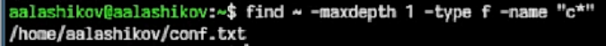

# Докладчик

:::::::::::::: {.columns align=center}
::: {.column width="70%"}

  * Лащиков Алексей Антонович
  * Студент группы НКАбд-04-25
  * Российский университет дружбы народов им. П. Лумумбы
  * [1032253527@rudn.ru](mailto:1032253527@rudn.ru)
  * <https://alexeylashikov.github.io/>

:::
::: {.column width="30%"}

:::
::::::::::::::

# Цель и задачи

**Цель:** изучить основные команды Linux для поиска файлов, перенаправления ввода-вывода, постраничного просмотра информации и управления процессами.

**Задачи:**

- записать результаты работы команд в текстовые файлы;
- отфильтровать строки по расширению `.conf`;
- выполнить поиск файлов по имени;
- использовать конвейер и постраничный просмотр;
- запустить фоновый процесс и проверить его работу;
- определить идентификатор процесса и завершить его;
- изучить команды `df`, `du` и `find`.

# Перенаправление ввода-вывода

В лабораторной работе использовались операции перенаправления вывода:

- `>` — записывает вывод в файл с перезаписью;
- `>>` — дописывает вывод в конец файла;
- `|` — передаёт вывод одной команды на вход другой.

Эти механизмы позволяют объединять несколько простых команд в единую цепочку обработки данных.

# Поиск файлов и фильтрация

Для выполнения заданий применялись команды:

- `find` — поиск файлов и директорий;
- `grep` — поиск строк по шаблону;
- `ls` — вывод содержимого каталогов;
- `less` — постраничный просмотр результата.

Например, шаблон `\.conf$` позволяет найти строки, оканчивающиеся на `.conf`.

# Фоновые процессы и управление задачами

В Linux программу можно запустить в фоне, добавив в конце команды символ `&`.

Для работы с такими задачами использовались:

- `jobs` — просмотр задач текущей оболочки;
- `ps` — просмотр процессов;
- `pgrep` и `pidof` — поиск PID по имени процесса;
- `kill` — завершение процесса по идентификатору.

# Запись данных в file.txt

На первом этапе в файл `file.txt` были записаны имена файлов из каталога `/etc`, после чего в этот же файл были дописаны имена файлов из домашнего каталога. Это позволило получить общий список имён для дальнейшей фильтрации.

{#fig-001 width=32%}

# Отбор строк с расширением .conf

Затем из файла `file.txt` были отобраны строки, оканчивающиеся на `.conf`. Сначала результат был выведен на экран, после чего сохранён в отдельный файл `conf.txt`.

:::::::::::::: {.columns align=center}
::: {.column width="50%"}

{#fig-002 width=60%}

:::
::: {.column width="50%"}

{#fig-003 width=80%}

:::
::::::::::::::

# Поиск файлов по имени

После этого были найдены файлы домашнего каталога, имена которых начинаются с буквы `c`. Для этого использовалась команда `find` с ограничением глубины поиска и указанием типа объекта.

Также был выполнен постраничный вывод имён файлов из каталога `/etc`, начинающихся с буквы `h`, с помощью связки `ls`, `grep` и `less`.

{#fig-004 width=82%}

# Работа с фоновым процессом

На следующем этапе был запущен фоновый процесс, записывающий в файл `~/logfile` имена файлов, начинающихся с `log`. Затем был просмотрен список задач и проверено содержимое созданного файла. После проверки файл `~/logfile` был удалён.

{#fig-005 width=82%}

# Запуск gedit и определение PID

Далее в фоновом режиме был запущен редактор `gedit`. После этого был определён идентификатор его процесса.

Таким образом, был найден PID процесса, необходимый для его завершения.

{#fig-006 width=52%}

# Завершение процесса и системные команды

После просмотра справки по команде `kill` процесс `gedit` был завершён по найденному идентификатору.

Кроме того, в ходе работы были изучены и выполнены команды:

- `df -h` — для просмотра информации о файловых системах;
- `du -sh ~` — для оценки объёма домашнего каталога;
- `find ~ -type d` — для вывода имён директорий домашнего каталога.

{#fig-007 width=82%}

# Основные результаты работы

В ходе лабораторной работы были освоены следующие практические приёмы:

- создание и заполнение текстовых файлов из результатов работы команд;
- фильтрация строк по шаблону;
- поиск файлов и каталогов;
- использование конвейеров и постраничного просмотра;
- запуск процессов в фоновом режиме;
- определение PID и завершение процесса;
- получение сведений о дисковом пространстве и структуре домашнего каталога.

# Выводы

В результате выполнения лабораторной работы были изучены базовые средства командной строки Linux, необходимые для повседневной работы пользователя и администратора.

Были освоены команды `grep`, `find`, `ps`, `jobs`, `kill`, `df`, `du`, а также механизмы перенаправления вывода и построения конвейеров.

Полученные навыки позволяют выполнять поиск файлов, анализировать результаты работы команд, управлять процессами и эффективнее работать в терминале.