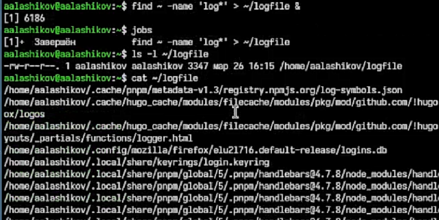

---
## Author
author:
  name: Лащиков Алексей Антонович
  email: "1032253527@rudn.ru"
  affiliation:
    - name: Российский университет дружбы народов
      country: Российская Федерация
      postal-code: 117198
      city: Москва
      address: ул. Миклухо-Маклая, д. 6

## Title
title: "Лабораторная работа №8"
subtitle: "Поиск файлов. Перенаправление ввода-вывода. Просмотр запущенных процессов"
license: "CC BY"

toc: true
toc-title: "Содержание"
number-sections: true

crossref:
  fig-title: "Рисунок"
  tbl-title: "Таблица"
  sec-prefix: "Раздел"
  fig-prefix: "Рис."
  tbl-prefix: "Табл."

format:
  pdf:
    pdf-engine: xelatex
    documentclass: article
    fontsize: 12pt
    linestretch: 1.2
    geometry: margin=2.5cm
    mainfont: "Times New Roman"
    sansfont: "Arial"
    monofont: "Consolas"
    include-in-header:
      text: |
        \usepackage{polyglossia}
        \setdefaultlanguage{russian}
        \usepackage{csquotes}
        \usepackage{caption}
        \captionsetup[figure]{name=Рисунок}
        \captionsetup[table]{name=Таблица}

  docx:
    toc: true

execute:
  echo: true
  warning: false
  error: false
---

# Цель работы

Цель данной лабораторной работы --- ознакомиться с инструментами поиска файлов и фильтрации текстовых данных, приобрести практические навыки перенаправления ввода-вывода, управления процессами и заданиями, а также изучить команды проверки использования диска и обслуживания файловых систем.

# Задание

1. Освоить приёмы перенаправления стандартного вывода и стандартного ввода.
2. Записать в `file.txt` названия файлов из каталога `/etc`, а затем дописать в этот же файл названия файлов из домашнего каталога.
3. Вывести из `file.txt` имена файлов с расширением `.conf` и записать их в новый файл `conf.txt`.
4. Определить, какие файлы в домашнем каталоге имеют имена, начинающиеся с символа `c`, и предложить несколько способов решения.
5. Вывести на экран постранично имена файлов из каталога `/etc`, начинающиеся с символа `h`.
6. Запустить в фоновом режиме процесс, который будет записывать в файл `~/logfile` файлы, имена которых начинаются с `log`.
7. Удалить файл `~/logfile`.
8. Запустить из консоли в фоновом режиме редактор `gedit`.
9. Определить идентификатор процесса `gedit` с помощью команды `ps`, конвейера и фильтра `grep`, а также указать другие способы определения PID.
10. Изучить справку команды `kill` и завершить процесс `gedit`.
11. Выполнить команды `df` и `du`, предварительно просмотрев их справку.
12. С помощью команды `find` вывести имена всех директорий, имеющихся в домашнем каталоге.

# Теоретическое введение

В Linux по умолчанию существуют три стандартных потока ввода-вывода: `stdin`, `stdout` и `stderr`. Стандартный поток ввода обычно связан с клавиатурой, а стандартные потоки вывода и ошибок --- с окном терминала. Перенаправление позволяет изменить направление этих потоков и записывать результаты работы команд в файлы или, наоборот, передавать данным командам содержимое файлов.

Операторы `>` и `>>` используются для перенаправления стандартного вывода в файл. Оператор `>` создаёт новый файл либо полностью перезаписывает уже существующий, а оператор `>>` добавляет новые данные в конец файла без удаления предыдущего содержимого.

Для обработки текстового вывода широко используется конвейер `|`, который передаёт результат одной команды на вход другой. Благодаря этому можно объединять несколько простых команд в одну последовательность обработки данных. Например, вывод команды `ls` можно передать команде `grep` для фильтрации строк по заданному шаблону.

Процессом называется выполняемая в системе программа, имеющая собственный идентификатор PID, состояние и используемые ресурсы. Для работы с процессами и заданиями применяются команды `ps`, `jobs`, `kill`, `pgrep` и `pidof`. Для поиска файлов используется команда `find`, для поиска по содержимому --- `grep`, а для оценки использования дискового пространства --- команды `df` и `du`.

# Выполнение работы

Сначала в файл `file.txt` были записаны имена файлов из каталога `/etc`. Затем в этот же файл были дописаны имена файлов из домашнего каталога пользователя. Для этого использовались операции перенаправления вывода `>` и `>>`. После выполнения команд содержимое файла `file.txt` было выведено на экран для проверки результата.

{#fig-001 width=75%}

На следующем этапе из файла `file.txt` были отобраны строки, оканчивающиеся на `.conf`. Для этого использовалась команда `grep` с шаблоном `\.conf$`, которая позволила вывести на экран только нужные строки.

{#fig-002 width=75%}

После этого найденные строки были записаны в новый файл `conf.txt`. Затем содержимое файла `conf.txt` было выведено на экран для проверки корректности выполненной записи.

{#fig-003 width=75%}

Далее были найдены файлы домашнего каталога, имена которых начинаются с буквы `c`. Для этого использовалась команда `find` с параметрами, ограничивающими поиск только файлами верхнего уровня домашнего каталога.

{#fig-004 width=75%}

Затем был выполнен постраничный вывод имён файлов из каталога `/etc`, начинающихся с буквы `h`. Для этого использовалась команда `ls`, результат работы которой передавался через конвейер команде `grep`, а затем выводился постранично с помощью `less`.

{#fig-005 width=75%}

На следующем этапе был запущен фоновый процесс, записывающий в файл `~/logfile` имена файлов, начинающихся с `log`. После этого был просмотрен список фоновых задач, а также проверено существование созданного файла и его содержимое.

{#fig-006 width=75%}

После проверки результата файл `~/logfile` был удалён. Для контроля также была выполнена команда проверки существования файла.

{#fig-007 width=75%}

Далее в фоновом режиме был запущен текстовый редактор `gedit`. После этого с помощью команды `jobs` был просмотрен список задач текущей оболочки, что позволило убедиться в запуске редактора как фонового процесса.

{#fig-008 width=75%}

После запуска редактора был определён идентификатор его процесса. Для этого использовалась команда `ps` совместно с конвейером и фильтром `grep`. Дополнительно были применены команды `pgrep` и `pidof`, которые также позволяют определить идентификатор процесса по его имени.

{#fig-009 width=75%}

Затем была изучена справочная информация по команде `kill`, после чего процесс редактора `gedit` был завершён по найденному идентификатору процесса.

{#fig-010 width=75%}

После этого были просмотрены справочные материалы по командам `df` и `du`. Затем была выполнена команда `df` для вывода информации о файловых системах и доступном дисковом пространстве, а также команда `du` для определения объёма пространства, занимаемого домашним каталогом пользователя.

{#fig-011 width=75%}

На заключительном этапе была изучена справка по команде `find`, после чего с её помощью были выведены имена всех директорий, расположенных в домашнем каталоге пользователя.

{#fig-012 width=75%}

# Ответы на контрольные вопросы

## 1. Какие потоки ввода-вывода вы знаете?

В Linux по умолчанию используются три стандартных потока ввода-вывода:

- `stdin` --- стандртный поток ввода, файловый дескриптор `0`;
- `stdout` --- стандартный поток вывода, файловый дескриптор `1`;
- `stderr` --- стандартный поток ошибок, файловый дескриптор `2`.

Обычно стандартный ввод связан с клавиатурой, а стандартный вывод и поток ошибок --- с окном терминала.

## 2. Объясните разницу между операцией `>` и `>>`.

Оператор `>` перенаправляет вывод в файл с полной перезаписью его содержимого. Если файл не существует, он будет создан. Оператор `>>` тоже перенаправляет вывод в файл, но не стирает старые данные, а добавляет новую информацию в конец файла.

## 3. Что такое конвейер?

Конвейер --- это механизм оболочки, при котором вывод одной команды передаётся на вход другой команды. Для создания конвейера используется символ `|`. Это позволяет объединять несколько простых команд в одну последовательность обработки данных.

Пример:

```bash
ls /etc | grep '^h'
```

## 4. Что такое процесс? Чем это понятие отличачается от программы?

Программа --- это набор команд, записанный в файле. Процесс --- это программа в момент выполнения. Процесс имеет собственное состояние, PID, используемую память и другие системные ресурсы. Одна и та же программа может быть запущена несколько раз, и тогда в системе будет существовать несколько разных процессов.

## 5. Что такое PID и GID?

`PID` --- это идентификатор процесса, то есть уникальный номер, по которому система различает запущенные процессы. `GID` --- это идентификатор группы пользователей. Он используется для разграничения доступа к файлам и другим системным объектам по группам.

## 6. Что такое задачи и какая команда позволяет ими управлять?

Задачи --- это процессы, которыми текущая оболочка управляет как фоновыми или приостановленными заданиями. Для просмотра задач используется команда `jobs`. Для управления ими также применяются `fg`, `bg` и `kill`, например `kill %1`.

## 7. Найдите информацию об утилитах `top` и `htop`. Каковы их функции?

Утилиты `top` и `htop` предназначены для интерактивного наблюдения за состоянием системы и процессов.

- `top` показывает список процессов, загрузку процессора, использование памяти, время работы системы и другие показатели;
- `htop` выполняет те же функции, но имеет более удобный интерфейс, цветовое выделение, возможность прокрутки и упрощённое управление процессами.

Обе утилиты используются для мониторинга системы и поиска процессов, создающих повышенную нагрузку.

## 8. Назовите и дайте характеристику команде поиска файлов. Приведите примеры использования этой команды.

Основной командой поиска файлов в Linux является `find`. Она позволяет искать файлы и каталоги по имени, типу, размеру, времени изменения, владельцу и другим признакам.

Примеры:

```bash
find ~ -name "*.txt"
find /etc -type f
find ~ -maxdepth 1 -type d
find ~ -name "log*"
```

## 9. Можно ли по контексту (содержанию) найти файл? Если да, то как?

Да, файл можно искать по содержимому. Для этого обычно используют команду `grep`, в том числе рекурсивно.

Примеры:

```bash
grep "main" file.c
grep -r "TODO" ~/projects
```

Первая команда ищет строку в одном файле, а вторая --- во всех файлах внутри каталога и его подкаталогов.

## 10. Как определить объём свободной памяти на жёстком диске?

Для определения свободного места на диске используется команда `df`. В удобной для чтения форме её обычно запускают так:

```bash
df -h
```

Команда показывает размеры файловых систем, объём занятого пространства и объём доступного места.

## 11. Как определить объём вашего домашнего каталога?

Для определения общего объёма домашнего каталога удобно использовать команду:

```bash
du -sh ~
```

Она показывает суммарный размер домашнего каталога в удобной для чтения форме.

## 12. Как удалить зависший процесс?

Для удаления зависшего процесса сначала нужно узнать его PID, например с помощью `ps`, `pgrep` или `pidof`, а затем отправить ему сигнал завершения командой `kill`.

Пример:

```bash
ps aux | grep program
kill 1234
```

Если процесс не завершается обычным сигналом, можно использовать принудительное завершение:

```bash
kill -9 1234
```

# Выводы

В ходе лабораторной работы были изучены основные средства Linux для перенаправления ввода-вывода, фильтрации текстовых данных, поиска файлов и управления процессами. Были отработаны операции записи вывода команд в файлы, дозаписи данных, поиска строк по шаблону, постраничного просмотра результатов, работы с фоновыми задачами и определения идентификаторов процессов.

Кроме того, были рассмотрены команды `df`, `du`, `find` и `kill`, позволяющие анализировать использование дискового пространства, искать файлы и директории, а также завершать процессы. Цель лабораторной работы была достигнута.