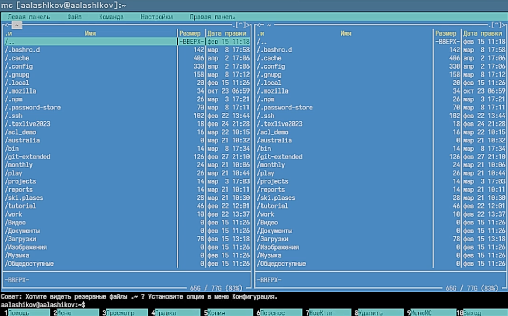
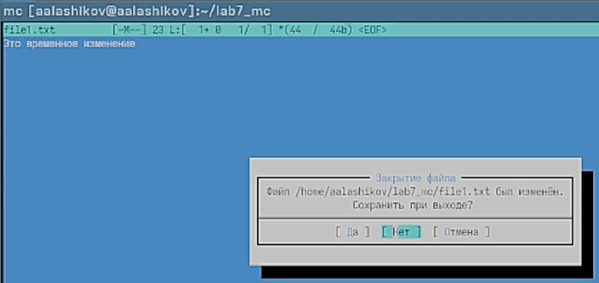

# Докладчик

:::::::::::::: {.columns align=center}
::: {.column width="70%"}

  * Лащиков Алексей Антонович
  * Студент группы НКАбд-04-25
  * Российский университет дружбы народов им. П. Лумумбы
  * [1032253527@rudn.ru](mailto:1032253527@rudn.ru)
  * <https://alexeylashikov.github.io/>

:::
::: {.column width="30%"}

:::
::::::::::::::

# Цель и задачи

**Цель:** освоить основные возможности командной оболочки Midnight Commander и получить навыки практической работы с каталогами и файлами.

**Задачи:**

- изучить справку и интерфейс программы `mc`;
- рассмотреть структуру панелей и меню;
- выполнить основные операции с файлами и каталогами;
- освоить команды подменю **Файл**, **Команда**, **Настройки**;
- изучить работу встроенного редактора Midnight Commander.

# Краткая теория

Midnight Commander (`mc`) — это файловый менеджер для Linux, работающий в текстовом режиме.

Его рабочее окно состоит из двух панелей, в которых отображается содержимое каталогов. Это позволяет удобно выполнять основные операции над файлами:

- просмотр;
- редактирование;
- копирование;
- перемещение;
- удаление;
- создание каталогов.

# Основные функциональные клавиши

Наиболее важные клавиши Midnight Commander:

- `F3` — просмотр файла;
- `F4` — редактирование файла;
- `F5` — копирование;
- `F6` — перемещение или переименование;
- `F7` — создание каталога;
- `F8` — удаление;
- `F9` — вызов меню;
- `F10` — выход из программы.

Также используются сочетания:

- `Ctrl+U` — перестановка панелей;
- `Ctrl+O` — скрытие или показ панелей.

# Структура окна mc

После запуска программы было изучено главное окно Midnight Commander.

{#fig-001 width=70%}

# Работа с панелями и файлами

В ходе работы были выполнены базовые действия с панелями и файлами.

{#fig-002 width=55%}

# Использование подменю панели и меню Файл

Далее были изучены основные команды панели и подменю **Файл**.

{#fig-003 width=40%}

# Встроенный редактор mc

Во встроенном редакторе был создан файл `text.txt`, после чего в него был вставлен текст и выполнены основные действия редактирования.

{#fig-004 width=62%}

# Меню Команда и Настройки

С помощью подменю **Команда** и **Настройки** были изучены дополнительные возможности программы.

{#fig-005 width=55%}

# Работа со встроенным редактором: результат

На заключительном этапе был создан и отредактирован файл `text.txt`.

Во время работы были отработаны команды редактирования текста, перемещения по файлу, сохранения и закрытия документа. Также был открыт файл с исходным кодом и проверена подсветка синтаксиса.

{#fig-006 width=55%}

# Выводы

В ходе лабораторной работы были изучены основные возможности Midnight Commander.

Были освоены:

- работа с панелями и меню;
- основные операции над файлами и каталогами;
- использование встроенного редактора;
- поиск файлов и настройка интерфейса программы.

Таким образом, цель лабораторной работы была достигнута: получены практические навыки работы с командной оболочкой Midnight Commander.