---
## Author
author:
  name: Лащиков Алексей Антонович
  email: "1032253527@rudn.ru"
  affiliation:
    - name: Российский университет дружбы народов
      country: Российская Федерация
      postal-code: 117198
      city: Москва
      address: ул. Миклухо-Маклая, д. 6

## Title
title: "Лабораторная работа №9"
subtitle: "Командная оболочка Midnight Commander"
license: "CC BY"

toc: true
toc-title: "Содержание"
number-sections: true

crossref:
  fig-title: "Рисунок"
  tbl-title: "Таблица"
  sec-prefix: "Раздел"
  fig-prefix: "Рис."
  tbl-prefix: "Табл."

format:
  pdf:
    pdf-engine: xelatex
    documentclass: article
    fontsize: 12pt
    linestretch: 1.2
    geometry: margin=2.5cm
    mainfont: "Times New Roman"
    sansfont: "Arial"
    monofont: "Consolas"
    include-in-header:
      text: |
        \usepackage{polyglossia}
        \setdefaultlanguage{russian}
        \usepackage{csquotes}
        \usepackage{caption}
        \captionsetup[figure]{name=Рисунок}
        \captionsetup[table]{name=Таблица}

  docx:
    toc: true

execute:
  echo: true
  warning: false
  error: false
---

# Цель работы

Цель данной лабораторной работы --- освоение основных возможностей командной оболочки Midnight Commander. Приобретение навыков практической работы по просмотру каталогов и файлов, а также выполнения операций над ними.

# Задание

## Задание по mc

1. Изучите информацию о mc, вызвав в командной строке `man mc`.
2. Запустите из командной строки mc, изучите его структуру и меню.

### Клавиши для редактирования файла

- `Ctrl+Y` --- удалить строку  
- `Ctrl+U` --- отмена последней операции  
- `Ins` --- вставка/замена  
- `F7` --- поиск (можно использовать регулярные выражения)  
- `Alt+F7` --- повтор последней операции поиска  
- `F4` --- замена  
- `F3` --- первое нажатие --- начало выделения, второе --- окончание выделения  
- `F5` --- копировать выделенный фрагмент  
- `F6` --- переместить выделенный фрагмент  
- `F8` --- удалить выделенный фрагмент  
- `F2` --- записать изменения в файл  
- `F10` --- выйти из редактора  

3. Выполните несколько операций в mc, используя управляющие клавиши (операции с панелями; выделение/отмена выделения файлов, копирование/перемещение файлов, получение информации о размере и правах доступа на файлы и/или каталоги и т.п.).

4. Выполните основные команды меню левой (или правой) панели. Оцените степень подробности вывода информации о файлах.

5. Используя возможности подменю **Файл**, выполните:
   - просмотр содержимого текстового файла;
   - редактирование содержимого текстового файла (без сохранения результатов редактирования);
   - создание каталога;
   - копирование файлов в созданный каталог.

6. С помощью соответствующих средств подменю **Команда** осуществите:
   - поиск в файловой системе файла с заданными условиями (например, файла с расширением `.c` или `.cpp`, содержащего строку `main`);
   - выбор и повторение одной из предыдущих команд;
   - переход в домашний каталог;
   - анализ файла меню и файла расширений.

7. Вызовите подменю **Настройки**. Освойте операции, определяющие структуру экрана mc (Full screen, Double Width, Show Hidden Files и т.д.).

## Задание по встроенному редактору mc

1. Создайте текстовый файл `text.txt`.
2. Откройте этот файл с помощью встроенного в mc редактора.
3. Вставьте в открытый файл небольшой фрагмент текста, скопированный из любого другого файла или интернета.
4. Проделайте с текстом следующие манипуляции, используя горячие клавиши:
   1. Удалите строку текста.
   2. Выделите фрагмент текста и скопируйте его на новую строку.
   3. Выделите фрагмент текста и перенесите его на новую строку.
   4. Сохраните файл.
   5. Отмените последнее действие.
   6. Перейдите в конец файла (нажав комбинацию клавиш) и напишите некоторый текст.
   7. Перейдите в начало файла (нажав комбинацию клавиш) и напишите некоторый текст.
   8. Сохраните и закройте файл.
5. Откройте файл с исходным текстом на некотором языке программирования (например, С или Java).
6. Используя меню редактора, включите подсветку синтаксиса, если она не включена, или выключите, если она включена.

# Теоретическое введение

Командная оболочка --- это интерфейс взаимодействия пользователя с операционной системой посредством ввода команд. Она позволяет выполнять различные операции с файлами, каталогами и программами.

Midnight Commander (mc) --- это псевдографическая командная оболочка для операционных систем семейства UNIX/Linux. Она представляет собой файловый менеджер, работающий в текстовом режиме, и значительно упрощает работу с файловой системой.

Рабочее окно Midnight Commander состоит из двух панелей, каждая из которых отображает содержимое определённого каталога. Пользователь может выполнять операции копирования, перемещения, удаления и редактирования файлов, используя функциональные клавиши.

Основные функциональные клавиши:

- F3 --- просмотр файла;
- F4 --- редактирование файла;
- F5 --- копирование файлов;
- F6 --- перемещение или переименование файлов;
- F7 --- создание каталога;
- F8 --- удаление файлов;
- F9 --- вызов меню;
- F10 --- выход из программы.

Также в mc предусмотрены различные режимы отображения информации (например, информация о файле или дерево каталогов), а также встроенный текстовый редактор, позволяющий выполнять базовые операции редактирования.

# Выполнение работы

Сначала была изучена справочная информация о командной оболочке Midnight Commander с помощью команды `man mc`. Были рассмотрены основные сведения о программе, её назначение и интерфейс (см. [рис.1](#fig-001)).

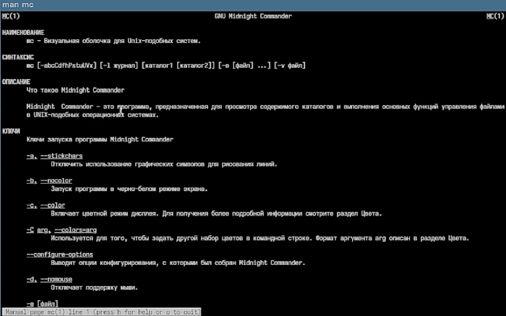{#fig-001 width=75%}

Далее была запущена программа Midnight Commander с помощью команды `mc`. После запуска было изучено рабочее окно программы (см. [рис.2](#fig-002)).

{#fig-002 width=75%}

После этого были выполнены операции с панелями: переключение между панелями, их перестановка (Ctrl+U) и скрытие (Ctrl+O) (см. [рис.3](#fig-003)).

{#fig-003 width=75%}

Далее было выполнено выделение файлов и снятие выделения (см. [рис.4](#fig-004)).

{#fig-004 width=75%}

После этого было выполнено копирование файлов с помощью клавиши F5 (см. [рис.5](#fig-005)).

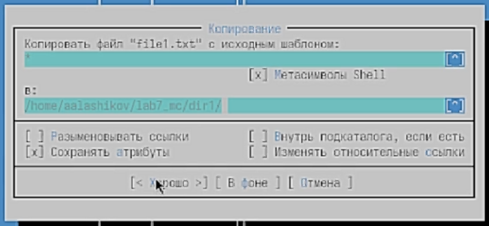{#fig-005 width=75%}

Затем было выполнено перемещение файлов с помощью клавиши F6 (см. [рис.6](#fig-006)).

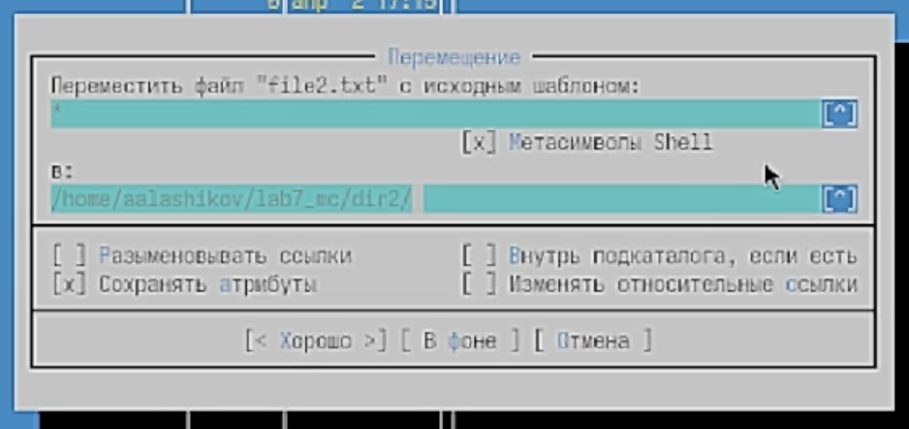{#fig-006 width=75%}

Далее была получена информация о файлах и каталогах, включая их права доступа (см. [рис.7](#fig-007)).

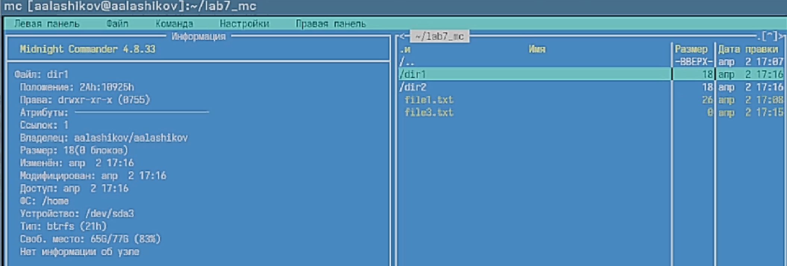{#fig-007 width=75%} 

После этого были изучены режимы отображения панелей (быстрый просмотр, информация, дерево каталогов) и форматы вывода (см. [рис.8](#fig-008)).

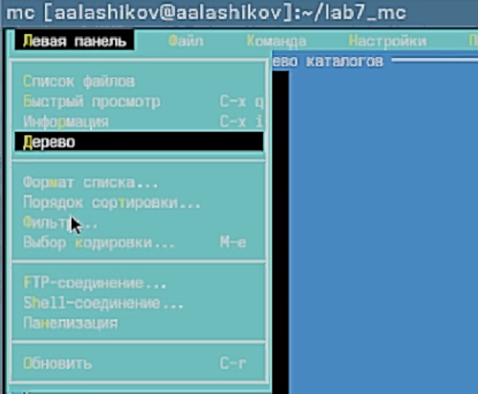{#fig-008 width=75%}

Затем был выполнен просмотр текстового файла с помощью клавиши F3 (см. [рис.9](#fig-009)).

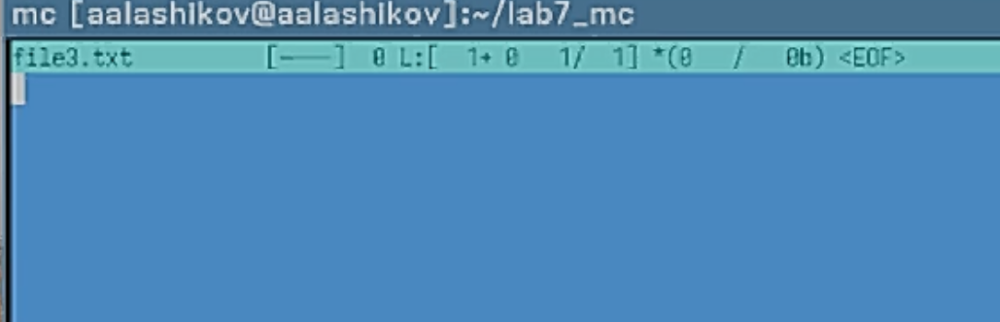{#fig-009 width=75%}

После этого файл был открыт в редакторе (F4), внесены изменения и выполнен выход без сохранения (см. [рис.10](#fig-010)).

{#fig-010 width=75%}

Далее был создан новый каталог с помощью клавиши F7 (см. [рис.11](#fig-011)).

{#fig-011 width=75%}

После этого файлы были скопированы в созданный каталог (см. [рис.12](#fig-012)).

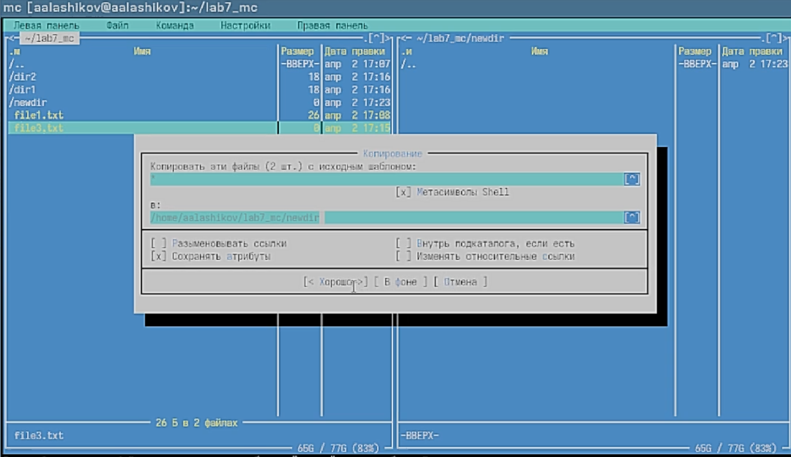{#fig-012 width=75%}

Затем был выполнен поиск файлов с использованием подменю "Команда" (см. [рис.13](#fig-013)).

{#fig-013 width=75%}

После этого была использована история командной строки (см. [рис.14](#fig-014)).

{#fig-014 width=75%}

Далее был выполнен переход в домашний каталог (см. [рис.15](#fig-015)).

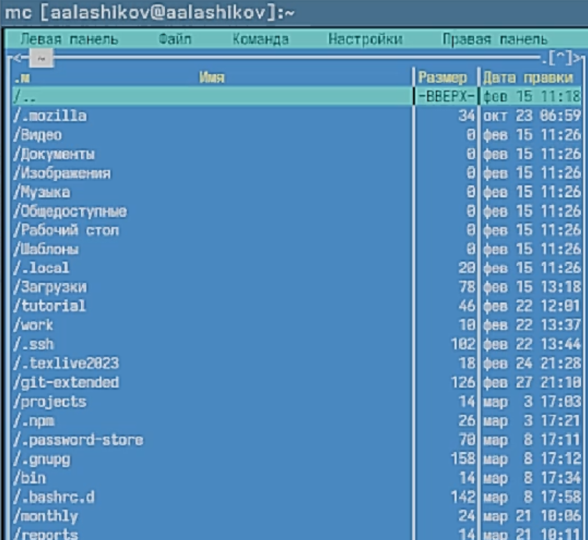{#fig-015 width=75%}

После этого были открыты файл меню и файл расширений (см. [рис.16](#fig-016), [рис.17](#fig-017)).

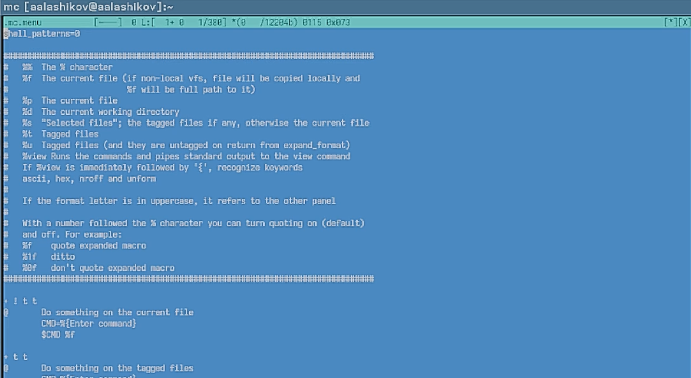{#fig-016 width=75%}

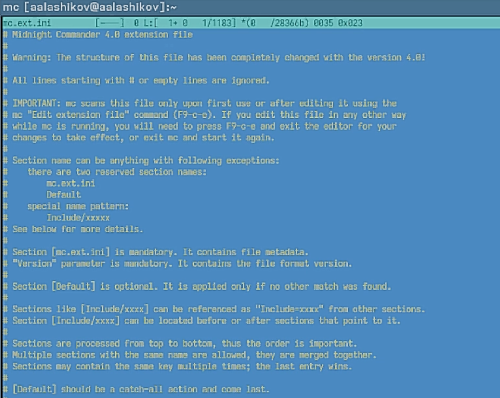{#fig-017 width=75%}

Затем были изучены настройки программы (см. [рис.18](#fig-018)).

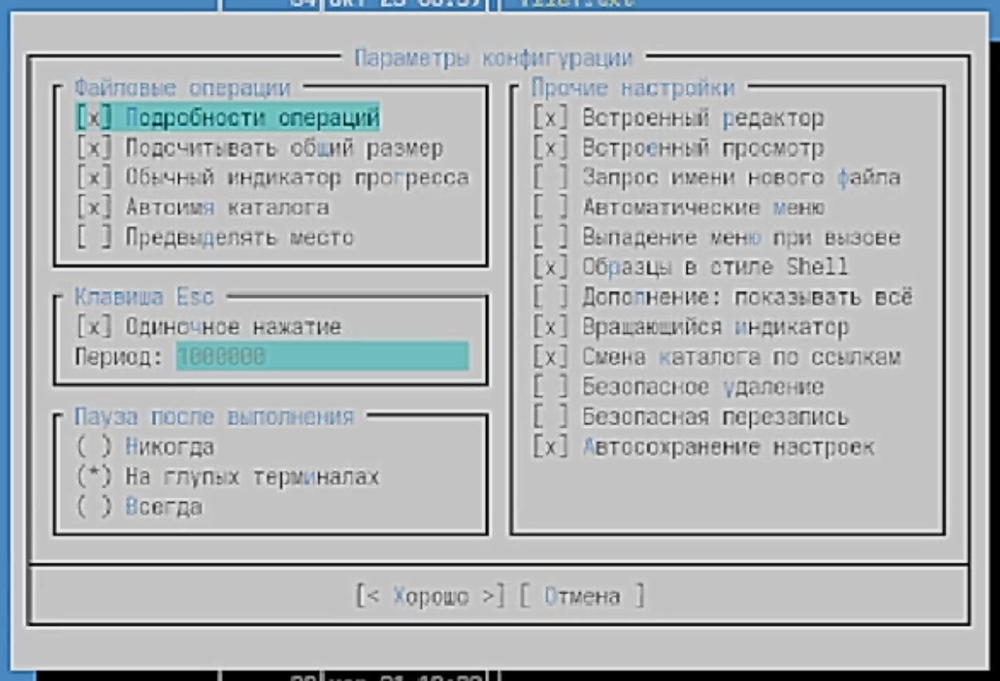{#fig-018 width=75%}

# Работа со встроенным редактором

Был создан файл `text.txt` и открыт во встроенном редакторе (см. [рис.19](#fig-019)).

{#fig-019 width=75%}

В файл был вставлен текст (см. [рис.20](#fig-020)).

{#fig-020 width=75%}

Далее была удалена строка с помощью Ctrl+Y (см. [рис.21](#fig-021)).

{#fig-021 width=75%}

Затем был выделен фрагмент текста и скопирован (см. [рис.22](#fig-022)).

{#fig-022 width=75%}

После этого фрагмент текста был перемещён (см. [рис.23](#fig-023)).

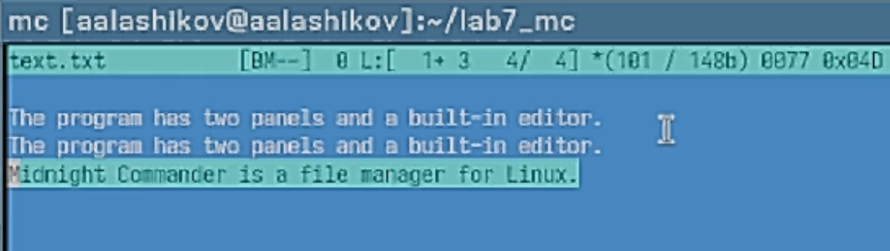{#fig-023 width=75%}

Файл был сохранён (см. [рис.24](#fig-024)).

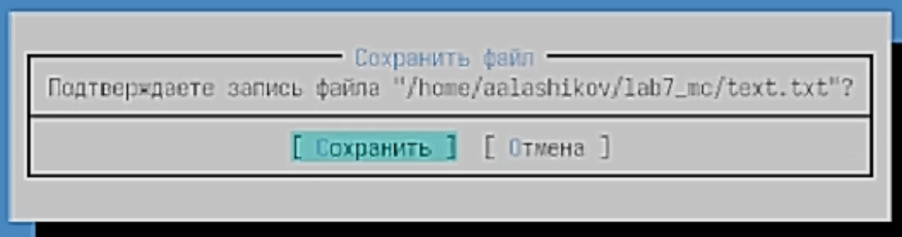{#fig-024 width=75%}

Была выполнена отмена последнего действия (см. [рис.25](#fig-025)).

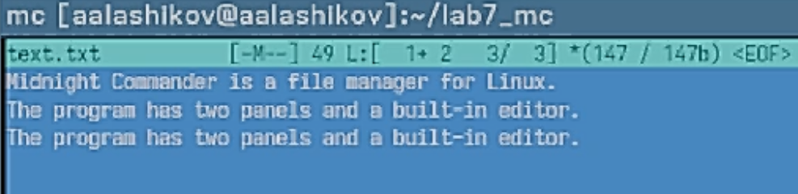{#fig-025 width=75%}

После этого был выполнен переход в конец и начало файла с добавлением текста (см. [рис.26](#fig-026)).

{#fig-026 width=75%}

Далее был открыт файл с программным кодом и выключена подсветка синтаксиса (см. [рис.27](#fig-027), [рис.28](#fig-028)).

{#fig-027 width=75%}

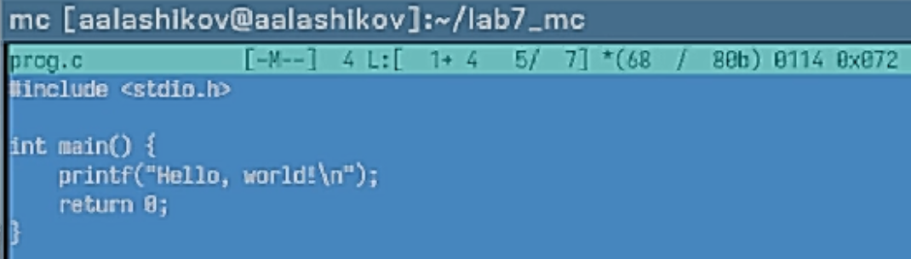{#fig-028 width=75%}

# Ответы на контрольные вопросы

### 1. Какие режимы работы есть в mc. Охарактеризуйте их.

В Midnight Commander предусмотрены различные режимы отображения панелей:

- **Стандартный режим** --- отображает список файлов с указанием имени, размера и времени изменения.
- **Информация** --- выводит сведения о выбранном файле и файловой системе.
- **Дерево каталогов** --- отображает иерархическую структуру каталогов.
- **Быстрый просмотр** --- позволяет просматривать содержимое файла без открытия редактора.

### 2. Какие операции с файлами можно выполнить как с помощью команд shell, так и с помощью меню mc?

С помощью shell и mc можно выполнять одинаковые операции:

- копирование файлов (`cp` / F5);
- перемещение и переименование (`mv` / F6);
- удаление (`rm` / F8);
- просмотр содержимого (`cat`, `less` / F3);
- редактирование (`nano`, `vim` / F4);
- создание каталогов (`mkdir` / F7).

### 3. Опишите структуру меню левой (или правой) панели mc.

Меню панели содержит команды управления отображением:

- **Быстрый просмотр** --- просмотр содержимого файлов;
- **Информация** --- отображение сведений о файле;
- **Дерево** --- отображение структуры каталогов;
- **Формат списка** --- выбор формата отображения файлов;
- **Порядок сортировки** --- выбор способа сортировки файлов.

### 4. Опишите структуру меню «Файл» mc.

Меню «Файл» содержит команды для работы с файлами:

- просмотр файла (F3);
- редактирование файла (F4);
- копирование (F5);
- перемещение/переименование (F6);
- создание каталога (F7);
- удаление (F8);
- изменение прав доступа;
- создание ссылок;
- изменение владельца и группы.

### 5. Опишите структуру меню «Команда» mc.

Меню «Команда» включает:

- дерево каталогов;
- поиск файлов;
- перестановку панелей;
- сравнение каталогов;
- просмотр истории команд;
- быстрый переход по каталогам;
- редактирование файла меню и файла расширений;
- настройку цветовой схемы.

### 6. Опишите структуру меню «Настройки» mc.

Меню «Настройки» содержит:

- конфигурацию программы;
- настройку внешнего вида;
- параметры отображения панелей;
- настройку подтверждений действий;
- проверку клавиш;
- параметры виртуальной файловой системы.

### 7. Назовите и дайте характеристику встроенным командам mc.

Встроенные команды mc:

- F3 --- просмотр файла;
- F4 --- редактирование файла;
- F5 --- копирование;
- F6 --- перемещение/переименование;
- F7 --- создание каталога;
- F8 --- удаление;
- F9 --- меню;
- F10 --- выход.

Они позволяют выполнять основные операции с файлами без использования командной строки.

### 8. Назовите и дайте характеристику командам встроенного редактора mc.

Основные команды редактора:

- Ctrl+Y --- удалить строку;
- Ctrl+U --- отмена действия;
- F3 --- выделение текста;
- F5 --- копирование выделенного;
- F6 --- перемещение выделенного;
- F8 --- удаление выделенного;
- F2 --- сохранить файл;
- F10 --- выйти;
- F7 --- поиск;
- F4 --- замена.

### 9. Средства mc для создания пользовательского меню.

Midnight Commander позволяет создавать пользовательское меню с помощью редактирования специального файла меню (вызывается через F2). Пользователь может добавить собственные команды и действия.

### 10. Средства mc для выполнения действий над текущим файлом.

Для выполнения действий над текущим файлом используется файл расширений. Он задаёт правила, по которым mc определяет, какие действия выполнять при открытии файлов разных типов (например, запуск программы для просмотра или редактирования).

# Вывод

В ходе выполнения лабораторной работы были изучены основные возможности командной оболочки Midnight Commander. Были освоены операции работы с файлами и каталогами, включая копирование, перемещение, удаление и редактирование. Также были изучены режимы отображения информации и работа встроенного редактора. Полученные навыки позволяют эффективно использовать Midnight Commander для управления файловой системой в операционной системе Linux.