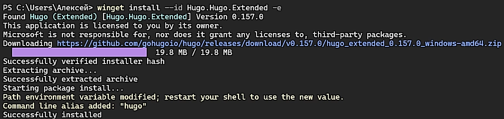
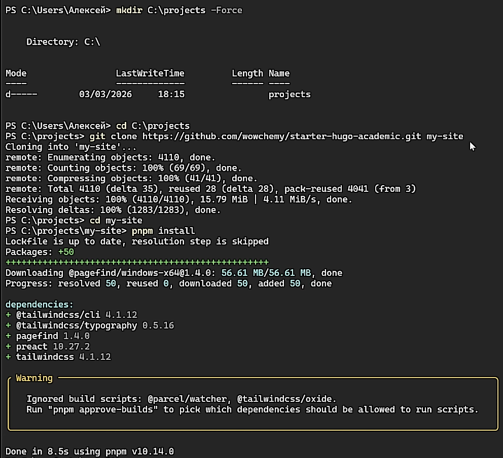
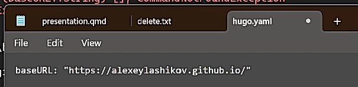
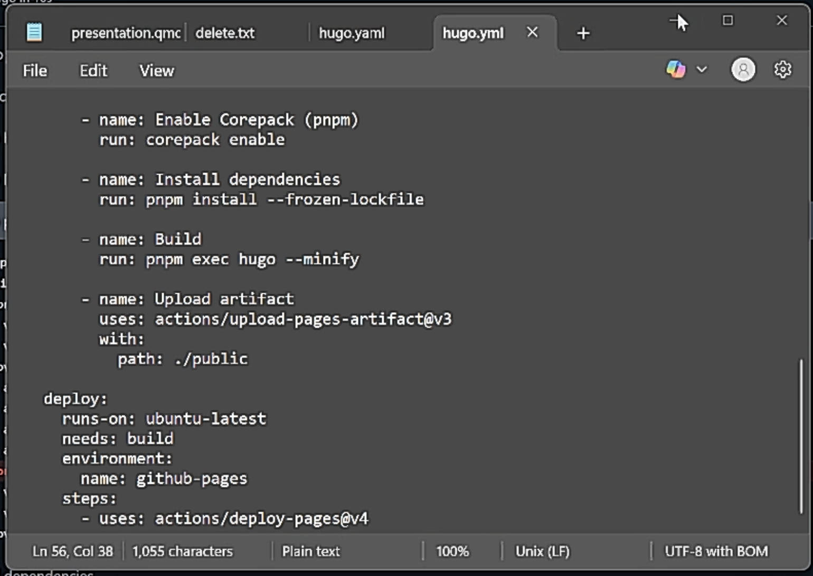

# Докладчик

:::::::::::::: {.columns align=center}
::: {.column width="70%"}

  * Лащиков Алексей Антонович
  * Студент группы НКАбд-04-25
  * Российский университет дружбы народов им. П. Лумумбы
  * [1032253527@rudn.ru](mailto:1032253527@rudn.ru)
  * <https://alexeylashikov.github.io/>

:::
::: {.column width="30%"}

:::
::::::::::::::

# Цель и задачи

**Цель:** развернуть заготовку персонального сайта на базе генератора статических сайтов Hugo и опубликовать сайт на GitHub Pages с автоматической сборкой через GitHub Actions.

**Задачи:**

- Установить необходимое программное обеспечение.
- Скачать шаблон темы сайта.
- Разместить его на хостинге git.
- Установить параметр для URLs сайта.
- Разместить заготовку сайта на Github pages.

# GitHub Pages

GitHub Pages — сервис публикации статических сайтов, который позволяет размещать веб-страницы напрямую из GitHub-репозитория.

- адрес сайта: `https://username.github.io/`
- источник публикации: ветка/папка или **GitHub Actions**
- удобно для портфолио и документации проектов

# Hugo

Hugo — генератор статических сайтов.

- собирает сайт из контента и темы в HTML/CSS/JS
- быстрый локальный предпросмотр

# GitHub Actions

Для автоматизации сборки и публикации удобно использовать GitHub Actions.

- сборка запускается в основную ветку
- уменьшает количество ручных действий

# Ход работы

В ходе работы я настроил окружение, запустил сайт локально, создал репозиторий `alexeylashikov.github.io`, включил GitHub Pages и добавил workflow GitHub Actions для автоматической сборки и деплоя сайта.

# Установка необходимого ПО

Сначала установил Git, Go и Node.js (@fig-001).

{#fig-001 width=80%}

# Установка Hugo

Установил Hugo Extended, чтобы корректно собирать проект (@fig-002).

{#fig-002 width=100%}

# Получение шаблона сайта

Склонировал шаблон, установил `pnpm` и зависимости проекта (@fig-003).

{#fig-003 width=40%}

# Локальный запуск

Запустил локальный сервер Hugo (@fig-004), убедился, что сборка проходит без ошибок и сайт открывается по адресу `http://localhost:1313/`.

{#fig-004 width=40%}

# Создание репозитория GitHub

Для публикации сайта создал публичный репозиторий `alexeylashikov.github.io` для GitHub Pages (@fig-006).

{#fig-006 width=40%}

# Настройка baseURL

Открыл файл конфигурации `hugo.yaml` и задал параметр `baseURL`, соответствующий будущему адресу GitHub Pages (@fig-007).

{#fig-007 width=100%}

# Подготовка контента для стабильной сборки

Для стабильной сборки в CI отключил демо-блог, так как он содержал внешние ресурсы и мог ломать сборку (@fig-008). Перенёс каталог `content/blog` в отдельную папку `content-disabled/blog`

{#fig-008 width=50%}

# Публикация проекта

Инициализировал git-репозиторий в проекте, создал коммит и отправил проект в репозиторий на GitHub (@fig-009).

{#fig-009 width=40%}

# Включение GitHub Pages

В настройках репозитория открыл раздел **Pages** и выбрал источник публикации **GitHub Actions** (@fig-010).

{#fig-010 width=90%}

# Workflow GitHub Actions

Добавил workflow `.github/workflows/hugo.yml` для сборки и деплоя (@fig-011):

- установка Hugo Extended;
- установка Node.js и зависимостей `pnpm`;
- сборка сайта (`hugo --minify`);
- публикация на GitHub Pages.

{#fig-011 width=30%}

# Коммит workflow

После добавления workflow сделал коммит и отправил изменения в репозиторий (@fig-012).

{#fig-012 width=100%}

# Проверка результата

Открыл опубликованный сайт по адресу `https://alexeylashikov.github.io/` и убедился, что сайт доступен и корректно отображается (@fig-013).

{#fig-013 width=70%}

# Выводы

- Установил необходимое программное обеспечение.
- Скачал шаблон темы сайта.
- Разместил его на хостинге git.
- Установил параметр для URLs сайта.
- Разместил заготовку сайта на Github pages.