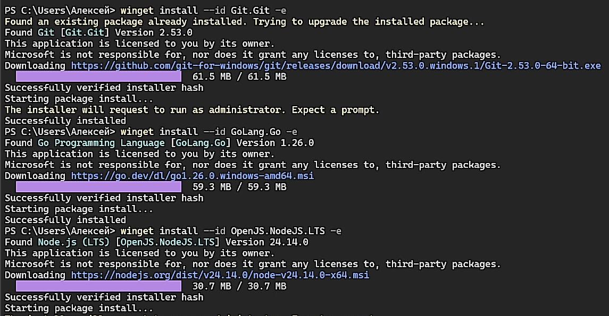
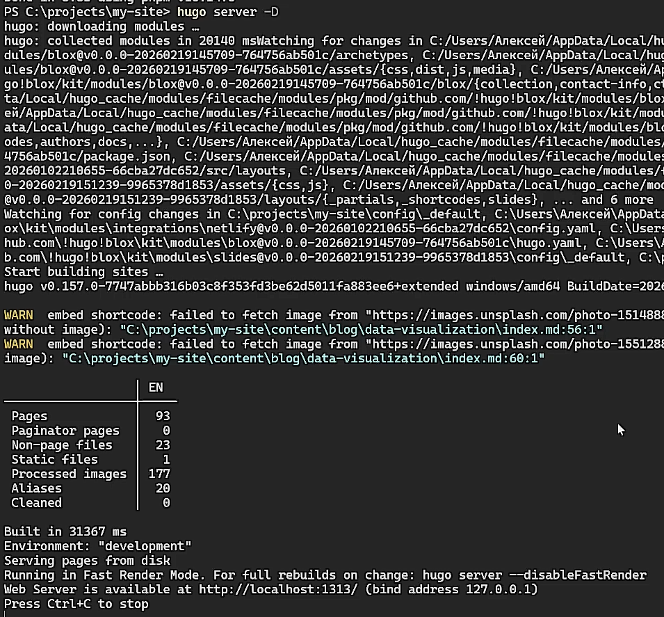
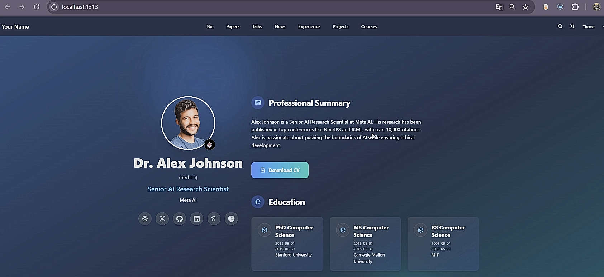
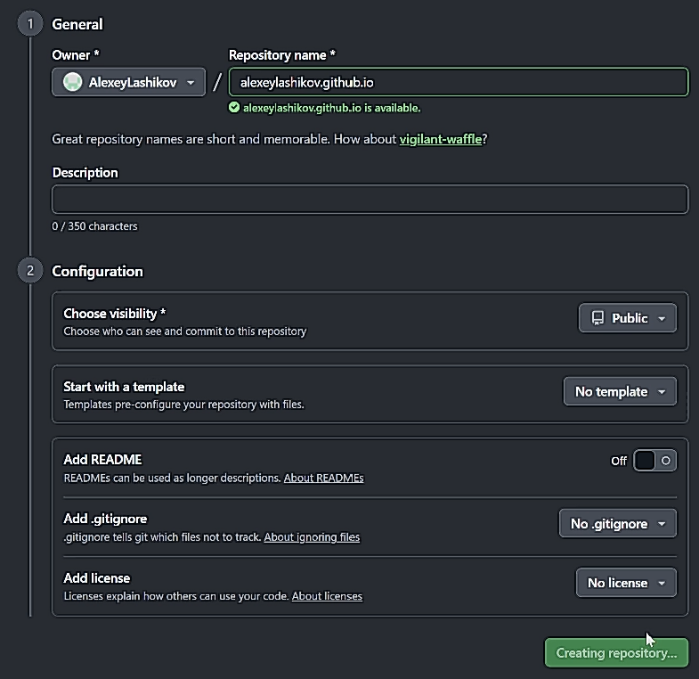
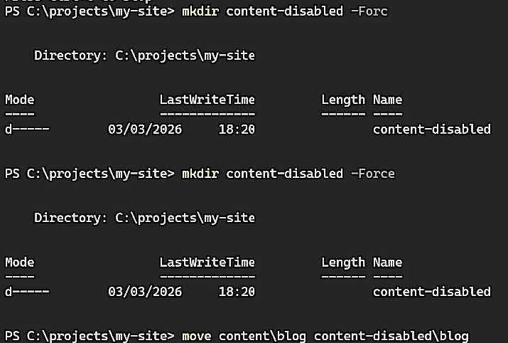
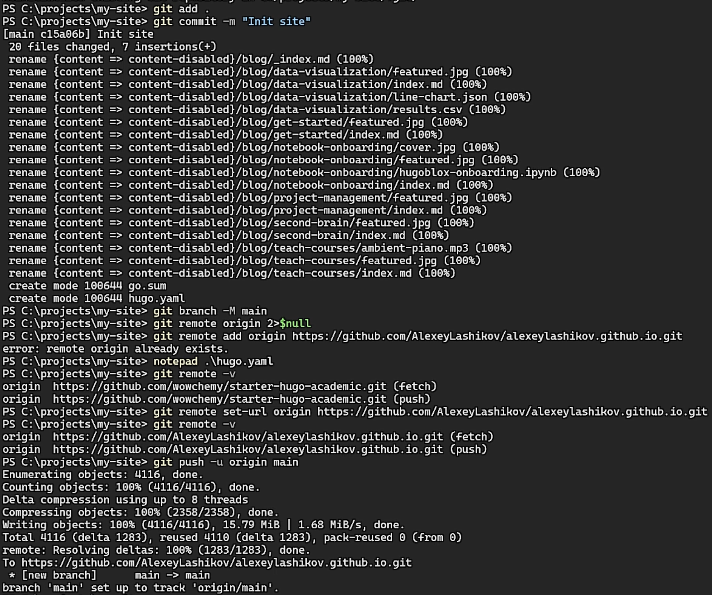
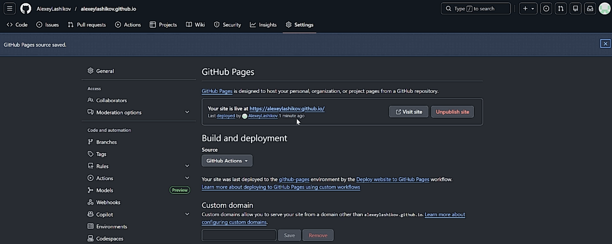
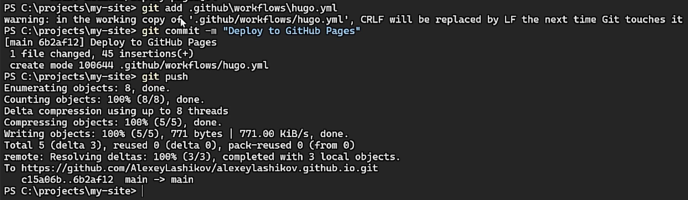

---
## Author
author:
  name: Лащиков Алексей Антонович
  email: "1032253527@rudn.ru"
  affiliation:
    - name: Российский университет дружбы народов
      country: Российская Федерация
      postal-code: 117198
      city: Москва
      address: ул. Миклухо-Маклая, д. 6

## Title
title: "Отчёт по первому этапу реализации индивидуального проекта"
subtitle: "Размещение на Github pages заготовки для персонального сайта"
license: "CC BY"

toc: true
toc-title: "Содержание"
number-sections: true

crossref:
  fig-title: "Рисунок"
  tbl-title: "Таблица"
  sec-prefix: "Раздел"
  fig-prefix: "Рис."
  tbl-prefix: "Табл."

format:
  pdf:
    pdf-engine: xelatex
    documentclass: article
    fontsize: 12pt
    linestretch: 1.2
    geometry: margin=2.5cm
    mainfont: "Times New Roman"
    sansfont: "Arial"
    monofont: "Consolas"
    include-in-header:
      text: |
        \usepackage{polyglossia}
        \setdefaultlanguage{russian}
        \usepackage{csquotes}
        \usepackage{caption}
        \captionsetup[figure]{name=Рисунок}
        \captionsetup[table]{name=Таблица}

  docx:
    toc: true
    reference-doc: "assets/reference.docx"

execute:
  echo: true
  warning: false
  error: false
---

# Цель работы

Цель данного этапа --- развернуть заготовку персонального сайта на базе генератора статических сайтов Hugo и опубликовать сайт на GitHub Pages с автоматической сборкой через GitHub Actions.

# Задание

- Установить необходимое программное обеспечение.
- Скачать шаблон темы сайта.
- Разместить его на хостинге git.
- Установить параметр для URLs сайта.
- Разместить заготовку сайта на Github pages.

# Теоретическое введение

GitHub Pages — сервис публикации статических сайтов, который позволяет размещать веб-страницы напрямую из GitHub-репозитория. Hugo — генератор статических сайтов, который собирает проект в набор HTML/CSS/JS-файлов. Для автоматизации сборки и публикации удобно использовать GitHub Actions: при каждом push в ветку `main` выполняется workflow, который устанавливает зависимости, собирает сайт и деплоит его на Pages.

В данной работе используется starter-шаблон Wowchemy/HugoBlox на Hugo. Для сборки темы применяется TailwindCSS, поэтому в CI требуется установка Node.js и зависимостей (через pnpm), чтобы был доступен `tailwindcss`.

# Выполнение лабораторной работы

## Установка необходимого ПО

Открыл командную строку и установил Git, Go и Node.js (@fig-001).

{#fig-001 width=80%}

Установил Hugo Extended (@fig-002).

{#fig-002 width=80%}

## Получение шаблона сайта

Создал рабочую папку, склонировал starter-шаблон и установил pnpm (@fig-003).

{#fig-003 width=80%}

Запустил локальный сервер Hugo (@fig-004).

{#fig-004 width=80%}

Убедился, что сайт открывается в браузере по адресу `http://localhost:1313/` (@fig-005).

{#fig-005 width=80%}

## Создание репозитория GitHub

Для публикации сайта создал публичный репозиторий с именем (`alexeylashikov.github.io`) (@fig-006).

{#fig-006 width=80%}

## Настройка baseURL

Открыл файл конфигурации `hugo.yaml` и задал параметр `baseURL`, соответствующий будущему адресу GitHub Pages (@fig-007).

{#fig-007 width=80%}

## Подготовка контента для стабильной сборки

Для стабильной сборки в CI временно отключил демонстрационный блог, так как он содержал примеры с загрузкой удалённых изображений, что могло приводить к нестабильности сборки. Для этого перенёс каталог `content/blog` в отдельную папку `content-disabled/blog` (@fig-008).

{#fig-008 width=80%}

## Публикация проекта в GitHub

Инициализировал git-репозиторий в проекте, создал коммит и отправил проект в репозиторий на GitHub (@fig-009).

{#fig-009 width=80%}

## Настройка GitHub Pages и GitHub Actions

В настройках репозитория открыл раздел Pages и выбрал источник публикации GitHub Actions (@fig-010).

{#fig-010 width=80%}

Далее создал workflow для автоматической сборки и деплоя. Файл расположен по пути `.github/workflows/hugo.yml`. В workflow добавлены шаги: установка Hugo Extended, установка Node.js, включение `corepack`, установка зависимостей и сборка сайта командой `pnpm exec hugo --minify`, после чего артефакт публикуется на GitHub Pages (@fig-011).

{#fig-011 width=80%}

После добавления workflow сделал коммит и отправил изменения в репозиторий (@fig-012).

{#fig-012 width=80%}

## Проверка результата

Открыл опубликованный сайт по адресу `https://alexeylashikov.github.io/` и убедился, что сайт доступен и корректно отображается (@fig-013).

{#fig-013 width=80%}

# Выводы

В ходе реализации данного этапа была развёрнута заготовка персонального сайта на базе генератора статических сайтов Hugo и опубликован сайт на GitHub Pages с автоматической сборкой через GitHub Actions.