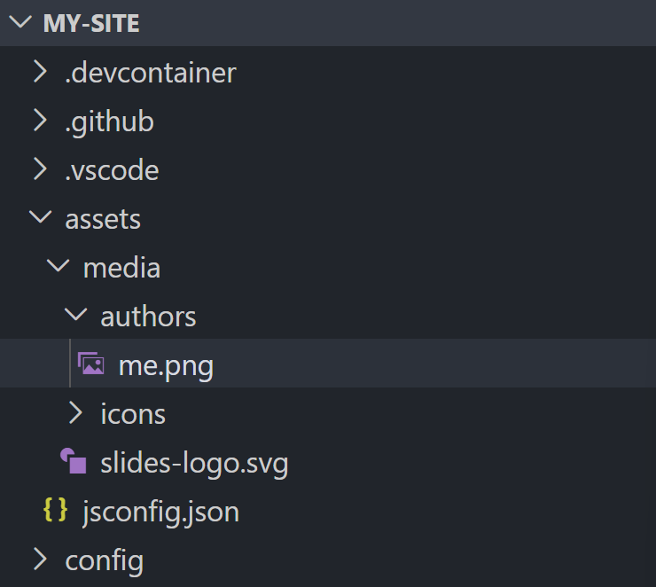
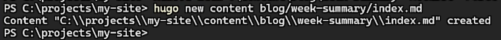
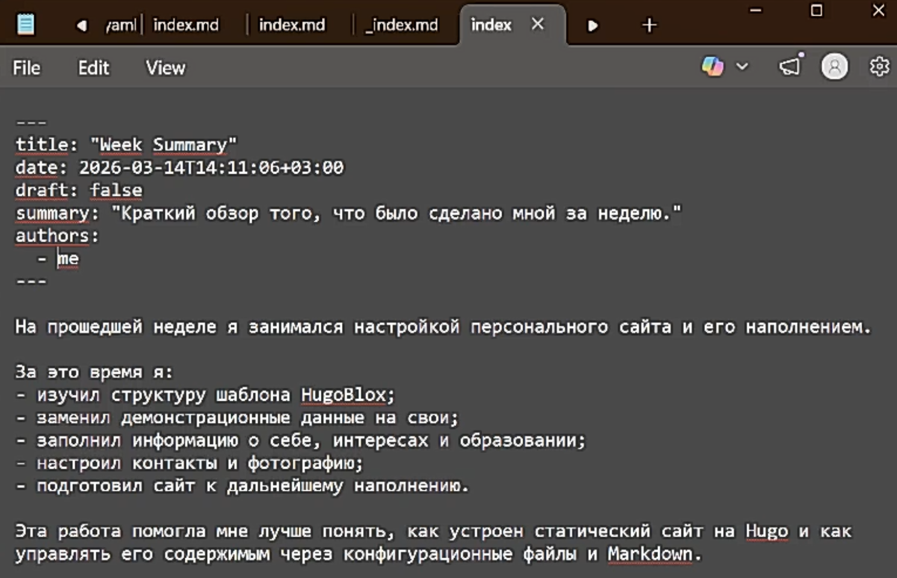
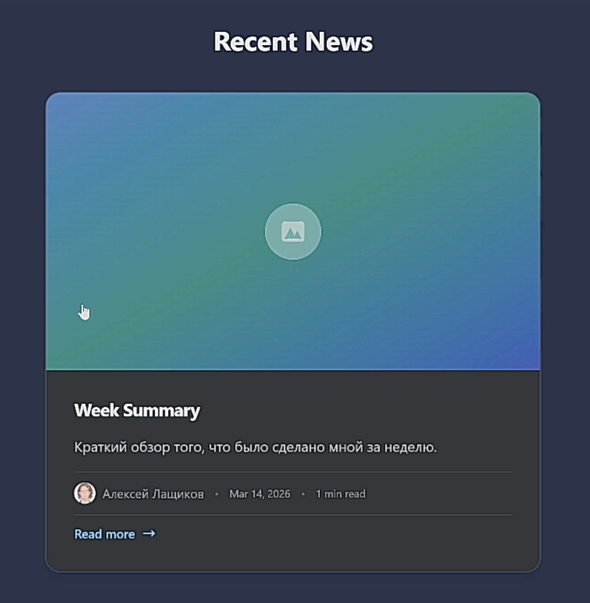
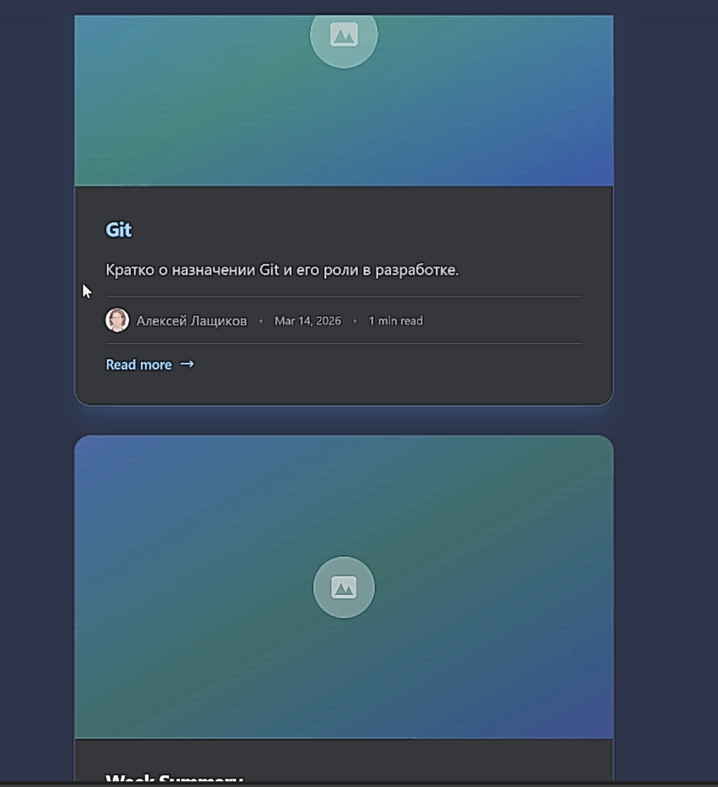

---
## Author
author:
  name: Лащиков Алексей Антонович
  email: "1032253527@rudn.ru"
  affiliation:
    - name: Российский университет дружбы народов
      country: Российская Федерация
      postal-code: 117198
      city: Москва
      address: ул. Миклухо-Маклая, д. 6

## Title
title: "Отчёт по второму этапу реализации индивидуального проекта"
subtitle: "Наполнение персонального сайта данными о владельце и новостными записями"
license: "CC BY"

toc: true
toc-title: "Содержание"
number-sections: true

crossref:
  fig-title: "Рисунок"
  tbl-title: "Таблица"
  sec-prefix: "Раздел"
  fig-prefix: "Рис."
  tbl-prefix: "Табл."

format:
  pdf:
    pdf-engine: xelatex
    documentclass: article
    fontsize: 12pt
    linestretch: 1.2
    geometry: margin=2.5cm
    mainfont: "Times New Roman"
    sansfont: "Arial"
    monofont: "Consolas"
    include-in-header:
      text: |
        \usepackage{polyglossia}
        \setdefaultlanguage{russian}
        \usepackage{csquotes}
        \usepackage{caption}
        \captionsetup[figure]{name=Рисунок}
        \captionsetup[table]{name=Таблица}

  docx:
    toc: true

execute:
  echo: true
  warning: false
  error: false
---

# Цель работы

Цель данного этапа --- дополнить персональный сайт сведениями о владельце, настроить отображение фотографии, образования и интересов, а также добавить новостные записи для наполнения главной страницы.

# Задание

- Разместить фотографию владельца сайта.
- Разместить краткое описание владельца сайта.
- Добавить информацию об интересах.
- Добавить информацию об образовании.
- Добавить пост по прошедшей неделе.
- Добавить пост на тему по выбору.

# Теоретическое введение

Персональный сайт на базе Hugo/HugoBlox формируется из набора конфигурационных файлов и контентных страниц. Информация о владельце сайта может храниться в отдельном YAML-файле, где задаются имя, роль, описание, аффилиация, интересы, образование, навыки и ссылки на внешние ресурсы. Такие данные затем автоматически используются шаблоном на главной странице сайта.

Графические ресурсы, в частности фотография владельца сайта, подключаются из каталога с медиафайлами. После замены изображения и обновления конфигурации сайт автоматически перестраивается и отображает новый контент.

Новостные записи в Hugo представляют собой отдельные Markdown-страницы с front matter. В нём задаются заголовок, дата публикации, краткое описание, автор и другие параметры. При корректной структуре каталога такие записи автоматически попадают в соответствующий блок главной страницы, например в раздел `Recent News`.

# Выполнение лабораторной работы

## Анализ структуры сайта

На начальном этапе изучил структуру проекта и определил файлы, отвечающие за отображение информации о владельце сайта и содержимого главной страницы (@fig-001).

{#fig-001 width=80%}

После этого открыл файл с описанием владельца сайта `data/authors/me.yaml`, в котором был размещён демонстрационный профиль. На его основе подготовил собственные данные для дальнейшего наполнения сайта (@fig-002).

{#fig-002 width=80%}

## Заполнение данных о владельце сайта

В файле `data/authors/me.yaml` заменил демонстрационные сведения на собственные: указал имя, роль, краткое описание, аффилиацию, список интересов, образование и ссылки на электронную почту и GitHub (@fig-003).

{#fig-003 width=80%}

Также открыл файл параметров сайта `config/_default/params.yaml` и изменил отображаемое имя в заголовке сайта, чтобы вместо демонстрационного названия использовалось собственное имя (@fig-004).

{#fig-004 width=80%}

## Обновление фотографии владельца сайта

Далее определил путь к изображению, используемому для аватара на главной странице. Для этого был найден графический файл `assets/media/authors/me.png`, после чего демонстрационное изображение было заменено на собственную фотографию (@fig-005).

{#fig-005 width=80%}

После замены изображения перезапустил локальный сервер Hugo и убедился, что на главной странице сайта отображаются обновлённые фотография, имя, описание, образование и ссылки (@fig-006).

{#fig-006 width=80%}

## Добавление новостной записи по прошедшей неделе

Для размещения первой записи создал новостную страницу с помощью команды Hugo, что позволило автоматически сформировать корректную структуру каталога и Markdown-файла (@fig-007).

```bash
hugo new content blog/week-summary/index.md
```

{#fig-007 width=80%}

После этого открыл созданный файл `content/blog/week-summary/index.md`, задал заголовок, дату публикации, краткое описание, автора и основной текст новости. Также для корректного отображения отключил режим черновика, установив параметр `draft: false` (@fig-008).

{#fig-008 width=80%}

После сохранения файла обновил локальный сайт и проверил, что созданная запись появилась в блоке `Recent News` на главной странице (@fig-009).

{#fig-009 width=80%}

## Добавление новостной записи на тему по выбору

Аналогично первой записи создал вторую страницу новостей, посвящённую системе управления версиями Git (@fig-010).

```bash
hugo new content blog/git/index.md
```

{#fig-010 width=80%}

В файле `content/blog/git/index.md` указал заголовок, дату, краткое описание, автора и основной текст записи, посвящённой назначению Git и его использованию при разработке сайта (@fig-011).

{#fig-011 width=80%}

После обновления локального сайта убедился, что на главной странице в разделе `Recent News` отображаются уже две собственные записи: новость по итогам прошедшей недели и новость о Git (@fig-012).

{#fig-012 width=80%}

# Выводы

В ходе выполнения второго этапа реализации индивидуального проекта персональный сайт был дополнен данными о владельце: размещены фотография, краткое описание, сведения об интересах и образовании, а также добавлены две новостные записи.
