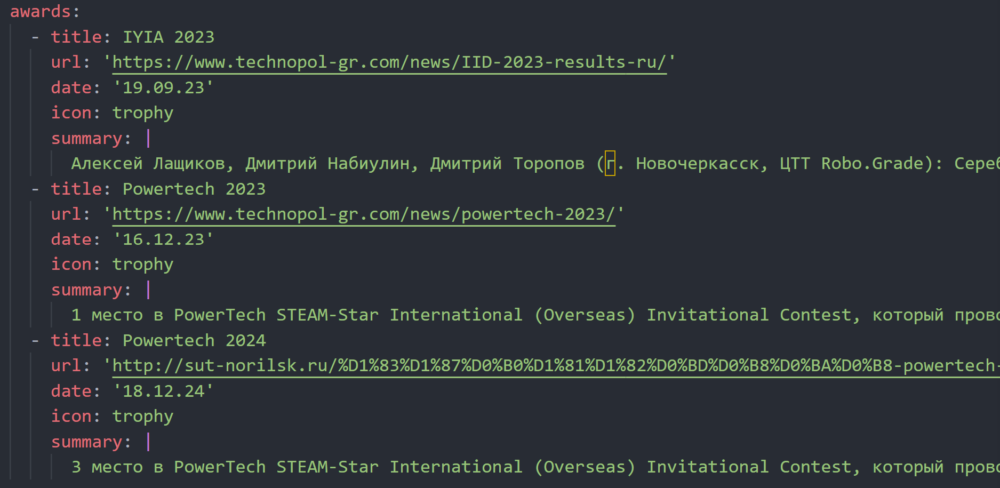
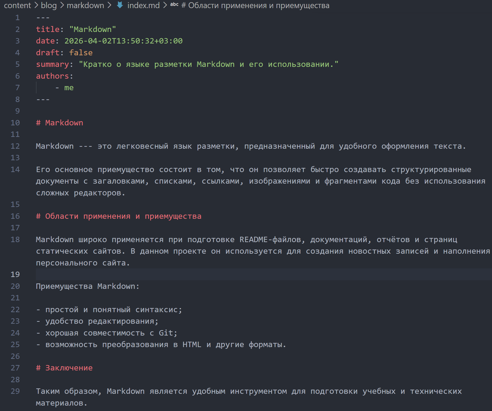

# Докладчик

:::::::::::::: {.columns align=center}
::: {.column width="70%"}

- Лащиков Алексей Антонович
- Студент группы НКАбд-04-25
- Российский университет дружбы народов им. П. Лумумбы
- [1032253527@rudn.ru](mailto:1032253527@rudn.ru)
- <https://alexeylashikov.github.io/>

:::
::: {.column width="30%"}


:::
::::::::::::::

# Цель и задачи

**Цель:** дополнить персональный сайт сведениями о навыках, опыте, достижениях и новостными записями.

**Задачи:**

- добавить информацию о навыках;
- добавить информацию об опыте;
- добавить информацию о достижениях;
- заполнить сведения о владении языками;
- создать пост по прошедшей неделе;
- создать пост на тему по выбору.

# Теоретическая основа

Персональный сайт создан на базе генератора статических сайтов **Hugo** и шаблона **HugoBlox**.

Основные данные о пользователе и его деятельности могут храниться в файле:

- `data/authors/me.yaml`

Именно из этого файла шаблон автоматически получает сведения для разделов:

- Skills;
- Experience;
- Awards;
- Languages.

# Новостные записи в Hugo

Новостные записи на сайте создаются как отдельные Markdown-файлы.

Для них указываются:

- заголовок;
- дата;
- краткое описание;
- автор;
- основной текст;
- параметр `draft`.

После сохранения такие записи автоматически появляются в разделе новостей сайта.

# Структура разделов сайта

Сначала был изучен файл `content/experience.md`, который отвечает за подключение блоков опыта, навыков, достижений и языков (@fig-001).

{#fig-001 width=20%}

# Основной файл с данными

После этого было установлено, что содержимое нужных разделов берётся из файла `data/authors/me.yaml`, поэтому дальнейшая работа велась именно в нём (@fig-002).

{#fig-002 width=40%}

# Добавление навыков

В разделе `skills` были указаны основные навыки, используемые в учебной и проектной деятельности. Для каждого навыка был задан уровень владения (@fig-003).

{#fig-003 width=30%}

# Добавление опыта

Далее был заполнен раздел `work`, отвечающий за вывод опыта.

В него были добавлены:

- учебные проекты;
- лабораторные работы;
- работа над персональным сайтом как частью индивидуального проекта.

{#fig-004 width=70%}

# Добавление достижений

Затем был заполнен раздел `awards`, который используется для вывода достижений на сайте.

{#fig-005 width=80%}

# Проверка разделов сайта

После заполнения разделов была выполнена проверка страницы сайта.

{#fig-006 width=26%}

# Создание поста по прошедшей неделе

Для добавления новой записи был использован генератор страниц Hugo:

```bash
hugo new content blog/week-summary-2/index.md
```

После этого был создан и заполнен файл записи (@fig-007).

{#fig-007 width=100%}

# Редактирование поста

В созданной записи были указаны заголовок, дата, описание, автор и основной текст. Также для публикации был установлен параметр:

```yaml
draft: false
```

{#fig-008 width=60%}

# Создание поста о Markdown

В качестве темы по выбору был выбран язык разметки **Markdown**.

Для этого была создана новая страница блога командой:

```bash
hugo new content blog/markdown/index.md
``` 

{#fig-009 width=100%}

# Заполнение записи о Markdown

После создания файла была подготовлена и заполнена запись, посвящённая языку разметки Markdown, его назначению и использованию при подготовке документов и наполнении сайта (@fig-010).

{#fig-010 width=40%}

# Результат на главной странице

После обновления локального сайта было проверено, что на главной странице в разделе новостей отображаются обе новые записи.

{#fig-011 width=24%}

# Выводы

* Добавил сведения о навыках.
* Добавил сведения об опыте.
* Добавил сведения о достижениях.
* Заполнил раздел о владении языками.
* Создал пост по прошедшей неделе.
* Создал пост на тему языка Markdown.

В результате персональный сайт стал более полным, информативным и удобным для дальнейшего развития.