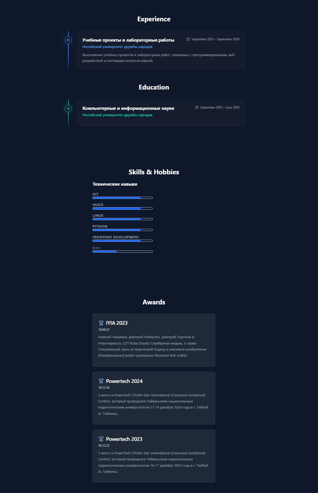
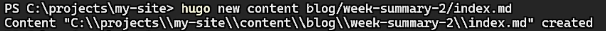
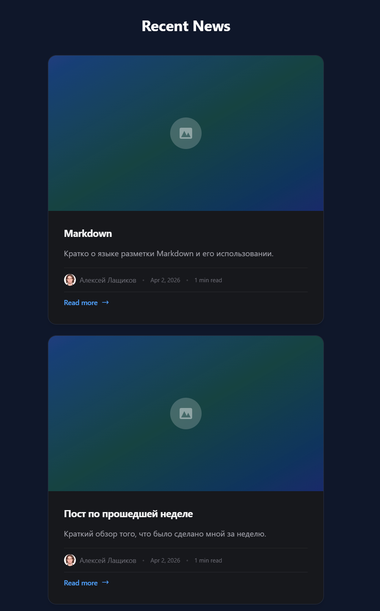

---
## Author
author:
  name: Лащиков Алексей Антонович
  email: "1032253527@rudn.ru"
  affiliation:
    - name: Российский университет дружбы народов
      country: Российская Федерация
      postal-code: 117198
      city: Москва
      address: ул. Миклухо-Маклая, д. 6

## Title
title: "Отчёт по третьему этапу реализации индивидуального проекта"
subtitle: "Наполнение персонального сайта данными о навыках, опыте, достижениях и новостными записями"
license: "CC BY"
toc: true
toc-title: "Содержание"
number-sections: true

crossref:
  fig-title: "Рисунок"
  tbl-title: "Таблица"
  sec-prefix: "Раздел"
  fig-prefix: "Рис."
  tbl-prefix: "Табл."

format:
  pdf:
    pdf-engine: xelatex
    documentclass: article
    fontsize: 12pt
    linestretch: 1.2
    geometry: margin=2.5cm
    mainfont: "Times New Roman"
    sansfont: "Arial"
    monofont: "Consolas"
    include-in-header:
      text: |
        \usepackage{polyglossia}
        \setdefaultlanguage{russian}
        \usepackage{csquotes}
        \usepackage{caption}
        \captionsetup[figure]{name=Рисунок}
        \captionsetup[table]{name=Таблица}

  docx:
    toc: true

execute:
  echo: true
  warning: false
  error: false
---

# Цель работы

Цель данного этапа — дополнить персональный сайт сведениями о навыках, опыте и достижениях, а также добавить новые новостные записи для дальнейшего наполнения сайта.

# Задание

- Добавить информацию о навыках (Skills).
- Добавить информацию об опыте (Experience).
- Добавить информацию о достижениях (Accomplishments).
- Сделать пост по прошедшей неделе.
- Добавить пост на тему по выбору:
- Легковесные языки разметки;
- Языки разметки. LaTeX;
- Язык разметки Markdown.

# Теоретическое введение

В шаблоне персонального сайта на базе Hugo/HugoBlox отдельные разделы страницы могут формироваться на основе данных из конфигурационных файлов и контентных страниц. Сведения о навыках, опыте, языках и достижениях могут храниться в файле `data/authors/me.yaml`, а затем автоматически использоваться соответствующими блоками шаблона. Такой подход уже использовался у тебя на предыдущем этапе для данных о владельце сайта. :contentReference[oaicite:2]{index=2}

Для отображения разделов опыта, навыков, достижений и языков на сайте используется отдельная страница с описанием секций, например `content/experience.md`. В ней задаются подключаемые блоки, а само содержимое берётся из авторского YAML-файла.

Новостные записи в Hugo создаются в виде отдельных Markdown-страниц с front matter, где указываются заголовок, дата, краткое описание, автор и другие параметры. После создания и сохранения таких файлов записи автоматически появляются в разделе новостей на главной странице сайта, как это уже было сделано на втором этапе. :contentReference[oaicite:3]{index=3}

# Выполнение лабораторной работы

## Анализ структуры раздела достижений

На начальном этапе открыл проект персонального сайта и изучил файлы, отвечающие за отображение разделов опыта, навыков, достижений и языков. Для этого был открыт файл `content/experience.md`, в котором определены блоки `resume-experience`, `resume-skills`, `resume-awards` и `resume-languages` (рис. 1).

{#fig-001 width=80%}

После этого было установлено, что содержимое указанных разделов берётся из файла `data/authors/me.yaml`, поэтому дальнейшее заполнение сайта выполнялось именно в нём (рис. 2).

{#fig-002 width=80%}

## Добавление информации о навыках

Далее в файле `data/authors/me.yaml` был заполнен раздел `skills`. В него были добавлены основные технические навыки, используемые при выполнении учебных и проектных работ: Git, Hugo, Linux, Python, Frontend Development и C++. Для каждого навыка был указан уровень владения (рис. 3).

{#fig-003 width=80%}

После сохранения файла была выполнена проверка локального сайта, чтобы убедиться, что сведения из раздела `skills` корректно отображаются в блоке Skills на странице сайта.

## Добавление информации об опыте

Затем в том же файле `data/authors/me.yaml` был заполнен раздел `work`, отвечающий за вывод информации об опыте. В качестве опыта были указаны учебные проекты и лабораторные работы в Российском университете дружбы народов, а также работа над персональным сайтом как частью индивидуального проекта (рис. 4).

{#fig-004 width=80%}

## Добавление информации о достижениях

На следующем этапе в файле `data/authors/me.yaml` был заполнен раздел `awards`, который используется блоком `resume-awards`. В него были добавлены сведения о публикации персонального сайта, наполнении сайта персональными данными и добавлении новых разделов с опытом и навыками (рис. 5).

{#fig-005 width=80%}

Дополнительно был заполнен раздел `languages`, чтобы на странице также отображались сведения о владении языками. После этого была выполнена проверка страницы сайта, и было подтверждено, что блоки Skills, Experience, Awards и Languages отображаются корректно (рис. 6).

{#fig-006 width=80%}

## Добавление новостной записи по прошедшей неделе

После заполнения основных разделов сайта была создана новая новостная запись по прошедшей неделе. Для этого в терминале была выполнена команда создания новой страницы Hugo, что позволило автоматически сформировать нужную структуру каталога и Markdown-файла (рис. 7).

```bash
hugo new content blog/week-summary-2/index.md
```

## Добавление новостной записи по прошедшей неделе

После заполнения основных разделов сайта была создана новая новостная запись по прошедшей неделе. Для этого в терминале была выполнена команда создания новой страницы Hugo, что позволило автоматически сформировать нужную структуру каталога и Markdown-файла (рис. 7).

```bash
hugo new content blog/week-summary-2/index.md
```

{#fig-007 width=80%}

Далее был открыт созданный файл `content/blog/week-summary-2/index.md`, после чего в нём были указаны заголовок, дата публикации, краткое описание, автор и основной текст записи. Для корректного отображения на сайте был отключён режим черновика, установив параметр `draft: false` (рис. 8).

{#fig-008 width=80%}

После сохранения изменений была проверена главная страница сайта, и было подтверждено, что новая запись появилась в разделе Recent News.

## Добавление новостной записи на тему по выбору

В качестве темы по выбору был выбран язык разметки Markdown. Для добавления новой записи была создана отдельная страница блога с помощью команды Hugo (рис. 9).

```bash
hugo new content blog/markdown/index.md
```

{#fig-009 width=80%}

После этого был открыт файл `content/blog/markdown/index.md`, в котором были заполнены заголовок, дата, краткое описание, автор и основной текст записи, посвящённой назначению языка Markdown и его использованию при подготовке документов и наполнении сайта (рис. 10).

{#fig-010 width=80%}

После обновления локального сайта было проверено, что на главной странице в разделе Recent News отображаются уже две новые записи данного этапа: запись по прошедшей неделе и запись о Markdown (рис. 11).

{#fig-011 width=80%}

# Выводы

В ходе выполнения третьего этапа реализации индивидуального проекта персональный сайт был дополнен сведениями о навыках, опыте, достижениях и владении языками. Кроме того, были добавлены две новые новостные записи: запись по прошедшей неделе и запись на тему языка разметки Markdown. В результате сайт стал более полным и информативным.