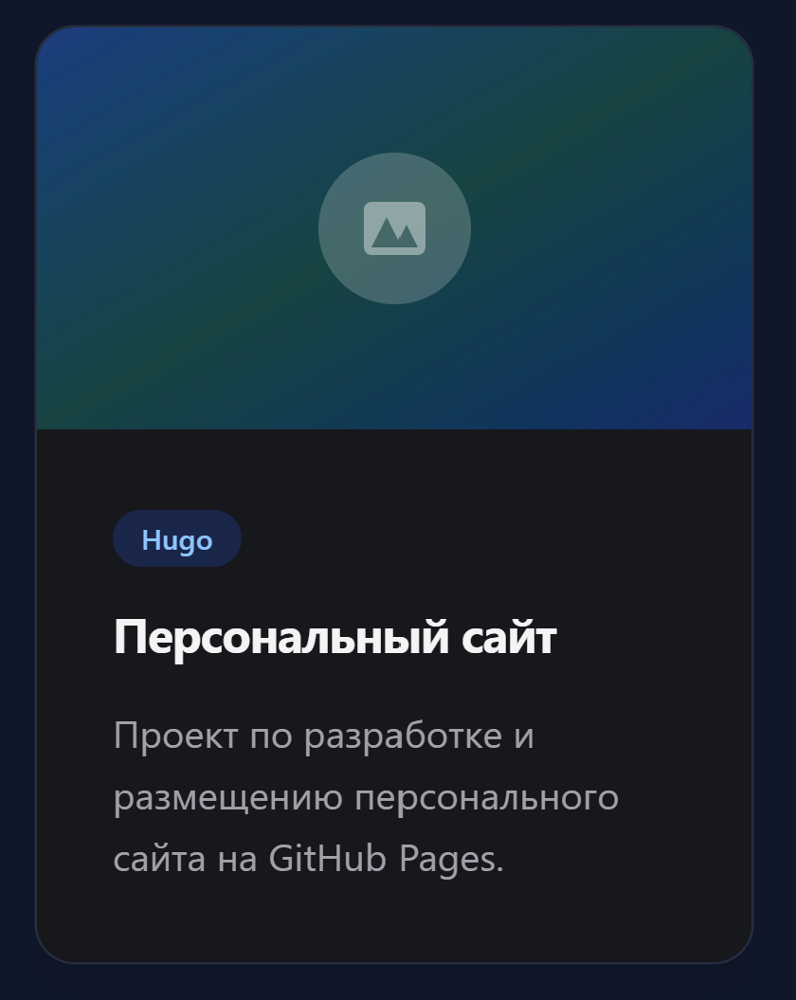
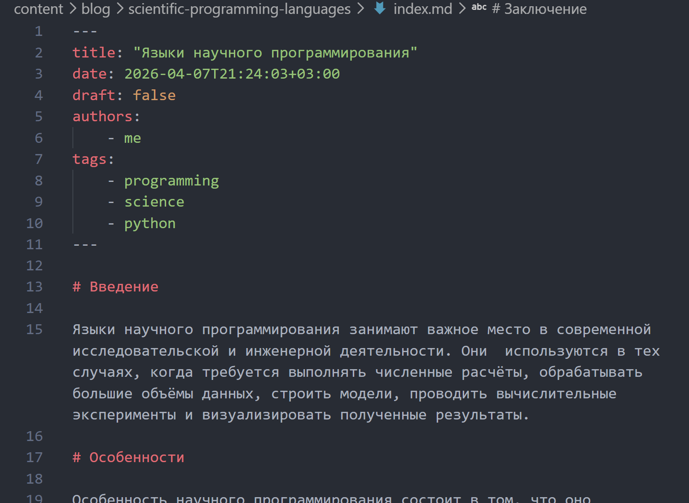
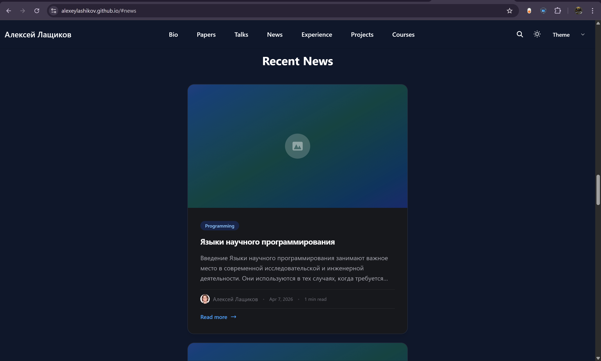

# Докладчик

:::::::::::::: {.columns align=center}
::: {.column width="70%"}

- Лащиков Алексей Антонович
- Студент группы НКАбд-04-25
- Российский университет дружбы народов им. П. Лумумбы
- [1032253527@rudn.ru](mailto:1032253527@rudn.ru)
- <https://alexeylashikov.github.io/>

:::
::: {.column width="30%"}


:::
::::::::::::::

# Цель и задачи

**Цель:** дополнить персональный сайт оставшимися элементами: записями о проектах и новыми новостными публикациями.

**Задачи:**

- создать записи для персональных проектов;
- добавить пост по прошедшей неделе;
- добавить пост на тему по выбору;
- подготовить публикацию на тему «Языки научного программирования»;
- проверить отображение нового контента на сайте.

# Теоретическая основа

Персональный сайт создан на базе генератора статических сайтов **Hugo** и шаблона **HugoBlox**.

Контент сайта может включать:

- основные данные о владельце;
- новостные записи;
- отдельные страницы проектов.

Каждый материал обычно оформляется как отдельный Markdown-файл с front matter.

# Контентные страницы в Hugo

В Hugo проекты и новостные записи создаются как отдельные страницы.

Для них указываются:

- заголовок;
- дата;
- краткое описание;
- автор;
- теги;
- основной текст;
- параметр `draft`.

После сохранения такие материалы автоматически подключаются к структуре сайта и отображаются в соответствующих разделах.

# Структура проекта сайта

Сначала была изучена структура проекта персонального сайта и определены каталоги, отвечающие за размещение материалов о проектах и новостных записей (@fig-001).

{#fig-001 width=22%}

# Папка с контентом сайта

После этого была открыта папка `content`, чтобы определить место размещения записей о проектах и новостных публикаций.

Это позволило понять, где должны создаваться новые материалы сайта (@fig-002).

{#fig-002 width=10%}

# Создание записи для проекта

Для добавления первого персонального проекта был использован генератор страниц Hugo:

```bash
hugo new content project/personal-website/index.md
```

После этого был создан файл проекта с нужной структурой (@fig-003).

{#fig-003 width=100%}

# Редактирование страницы проекта

В созданном файле были указаны заголовок, дата, краткое описание, автор, теги и основной текст проекта.

Таким образом была подготовлена отдельная страница, посвящённая персональному проекту (@fig-004).

{#fig-004 width=35%}

# Добавленные проекты в структуре сайта
После создания страниц было проверено, что записи проектов появились в структуре сайта и корректно размещены в каталоге проектов (@fig-005).

{#fig-005 width=20%}

# Проверка отображения проектов

Далее была открыта локальная версия сайта, чтобы убедиться, что страницы проектов доступны и корректно отображаются на сайте (@fig-006).

{#fig-006 width=28%}

# Создание поста по прошедшей неделе

Следующим этапом была создана новая новостная запись по прошедшей неделе.

Для этого использовалась команда:

```bash
hugo new content blog/week-summary-4/index.md
```

После этого был создан и заполнен файл записи (@fig-007).

{#fig-007 width=100%}

# Редактирование weekly post

В созданной записи были указаны заголовок, дата, описание, автор и основной текст.

Для публикации также был установлен параметр:

```yaml
draft: false
```

{#fig-008 width=40%}

# Проверка weekly post на сайте

После сохранения изменений была проверена главная страница сайта.

Новая запись по прошедшей неделе успешно появилась в разделе новостей (@fig-009).

{#fig-009 width=50%}

# Создание поста о языках научного программирования

В качестве темы по выбору были выбраны **языки научного программирования**.

Для этого была создана новая страница блога командой:

```bash
hugo new content blog/scientific-programming-languages/index.md
```

{#fig-010 width=100%}

# Заполнение тематической записи

После создания файла была подготовлена и заполнена запись, посвящённая языкам научного программирования, их назначению, применению в вычислениях и анализе данных, а также примерам таких языков (@fig-011).

{#fig-011 width=48%}

# Результат на главной странице

После обновления локального сайта было проверено, что в разделе новостей отображаются обе новые публикации:

* пост по прошедшей неделе;
* пост о языках научного программирования.

{#fig-012 width=50%}

# Итоговая локальная проверка

После завершения редактирования всех файлов был запущен локальный сервер Hugo для итоговой проверки конфигурации сайта и отображения нового контента (@fig-013).

{#fig-013 width=40%}

# Публикация изменений в GitHub

После этого изменения были добавлены в git, зафиксированы коммитом и отправлены в удалённый репозиторий GitHub (@fig-014).

{#fig-014 width=85%}

# Проверка опубликованного сайта

На заключительном этапе была открыта опубликованная версия сайта.

Проверка показала, что записи о проектах и новые новостные публикации стали доступны в онлайн-версии сайта (@fig-015).

{#fig-015 width=50%}

# Выводы

* Создал записи для персональных проектов.
* Добавил пост по прошедшей неделе.
* Создал тематический пост о языках научного программирования.
* Проверил отображение нового контента на локальной версии сайта.
* Опубликовал изменения в GitHub и проверил итоговый результат.

В результате персональный сайт был дополнен оставшимися элементами и стал более полным и информативным.