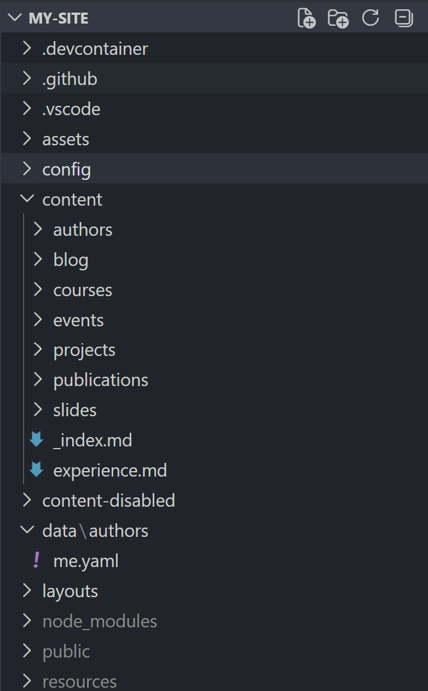
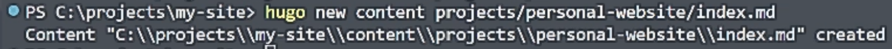
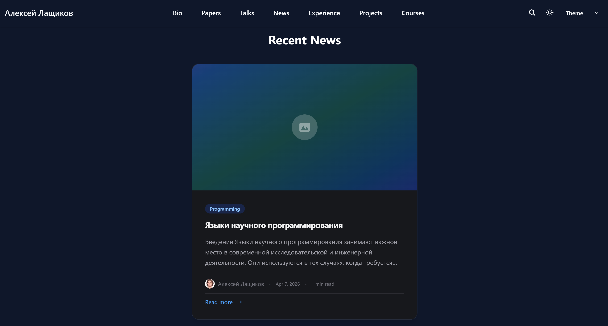
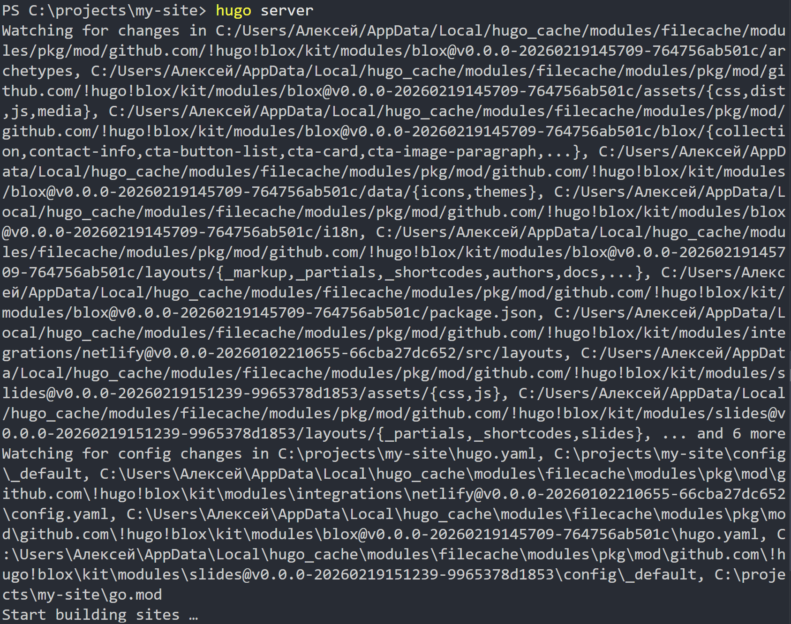

---
## Author
author:
  name: Лащиков Алексей Антонович
  email: "1032253527@rudn.ru"
  affiliation:
    - name: Российский университет дружбы народов
      country: Российская Федерация
      postal-code: 117198
      city: Москва
      address: ул. Миклухо-Маклая, д. 6

## Title
title: "Отчёт по пятому этапу реализации индивидуального проекта"
subtitle: "Добавление к персональному сайту записей для персональных проектов и постов"
license: "CC BY"
toc: true
toc-title: "Содержание"
number-sections: true

crossref:
  fig-title: "Рисунок"
  tbl-title: "Таблица"
  sec-prefix: "Раздел"
  fig-prefix: "Рис."
  tbl-prefix: "Табл."

format:
  pdf:
    pdf-engine: xelatex
    documentclass: article
    fontsize: 12pt
    linestretch: 1.2
    geometry: margin=2.5cm
    mainfont: "Times New Roman"
    sansfont: "Arial"
    monofont: "Consolas"
    include-in-header:
      text: |
        \usepackage{polyglossia}
        \setdefaultlanguage{russian}
        \usepackage{csquotes}
        \usepackage{caption}
        \captionsetup[figure]{name=Рисунок}
        \captionsetup[table]{name=Таблица}

  docx:
    toc: true

execute:
  echo: true
  warning: false
  error: false
---

# Цель работы

Целью данного этапа является дополнение персонального сайта оставшимися элементами, а именно: добавление записей о персональных проектах, создание новой новостной записи по прошедшей неделе и размещение тематического поста о языках научного программирования.

# Задание

Сделать записи для персональных проектов.

Сделать пост по прошедшей неделе.

Добавить пост на тему по выбору:

- Языки научного программирования.

# Теоретическое введение

Персональный сайт на базе Hugo/HugoBlox формируется из отдельных контентных страниц и конфигурационных файлов. Помимо основной информации о владельце сайта и новостных записей, на сайте могут размещаться отдельные страницы, посвящённые персональным проектам. Такие страницы позволяют представить учебную, исследовательскую или проектную деятельность в более структурированном виде.

В Hugo каждый проект или публикация обычно оформляется как отдельная Markdown-страница с front matter. В нём указываются заголовок, дата, краткое описание, автор, теги и другие параметры. Благодаря этому шаблон сайта может автоматически выводить такие материалы в нужных разделах страницы.

Новостные записи на сайте также создаются как отдельные Markdown-файлы. После их сохранения и отключения режима черновика записи автоматически появляются в блоке новостей. Это позволяет постепенно наполнять сайт новым содержимым и поддерживать его актуальность.

# Выполнение лабораторной работы

## Анализ структуры сайта и подготовка раздела проектов

На начальном этапе была открыта структура проекта персонального сайта и определены каталоги, отвечающие за размещение материалов о персональных проектах и новостных записей.

{#fig-001 width=80%}

После этого была открыта папка с контентом сайта, чтобы определить, в каком каталоге будут размещаться записи о персональных проектах. Также была проверена общая структура существующих материалов, чтобы новые записи соответствовали уже используемому формату.

{#fig-002 width=80%}

## Создание записей для персональных проектов

На следующем этапе были созданы отдельные страницы для персональных проектов. Для этого использовался генератор страниц Hugo, который автоматически создаёт каталог проекта и файл `index.md` с нужной структурой.

```bash
hugo new content project/personal-website/index.md
```

{#fig-003 width=80%}

После создания страницы был открыт файл проекта, в котором были указаны заголовок, дата, краткое описание, автор, теги и основной текст, описывающий содержание проекта.

{#fig-004 width=80%}

При необходимости аналогичным образом были созданы и заполнены другие страницы персональных проектов, чтобы раздел сайта стал более полным и отражал основную проектную деятельность.

{#fig-005 width=80%}

## Проверка отображения проектов на сайте

После сохранения файлов была открыта локальная версия сайта для проверки отображения записей о персональных проектах. Это позволило убедиться, что новые страницы корректно подключены и доступны на сайте.

{#fig-006 width=80%}

## Создание поста по прошедшей неделе

После добавления проектов была создана новая новостная запись по прошедшей неделе. Для этого в терминале была выполнена команда создания новой страницы блога.

```bash
hugo new content blog/week-summary-4/index.md
```

{#fig-007 width=80%}

После этого был открыт созданный файл `content/blog/week-summary-4/index.md`, в котором были заполнены заголовок, дата публикации, краткое описание, автор и основной текст записи. Для публикации был установлен параметр `draft: false`.

{#fig-008 width=80%}

Далее была проверена главная страница сайта, чтобы убедиться, что новая запись появилась в блоке новостей и корректно отображается в списке публикаций.

{#fig-009 width=80%}

## Создание поста на тему «Языки научного программирования»

В качестве темы по выбору был выбран материал о языках научного программирования. Для этого была создана отдельная страница блога с помощью команды Hugo.

```bash
hugo new content blog/scientific-programming-languages/index.md
```

{#fig-010 width=80%}

После создания файла был открыт Markdown-документ записи, в котором были заполнены заголовок, дата, краткое описание, автор и основной текст. В записи были рассмотрены назначение языков научного программирования, их роль в вычислениях, анализе данных и моделировании, а также приведены примеры таких языков.

{#fig-011 width=80%}

После сохранения изменений была проверена главная страница сайта, чтобы убедиться, что тематическая запись также появилась в разделе новостей.

{#fig-012 width=80%}

## Проверка итогового результата и публикация сайта

После завершения редактирования всех файлов был запущен локальный сервер Hugo для итоговой проверки корректности конфигурации сайта и отображения добавленного контента.

{#fig-013 width=80%}

Затем изменения были добавлены в git, зафиксированы коммитом и отправлены в удалённый репозиторий GitHub. После этого была проверена опубликованная версия сайта.

{#fig-014 width=80%}

На заключительном этапе была открыта опубликованная версия персонального сайта, чтобы убедиться, что записи о проектах и новые новостные публикации доступны в онлайн-версии.

{#fig-015 width=80%}

# Выводы

В ходе выполнения пятого этапа реализации индивидуального проекта персональный сайт был дополнен оставшимися элементами. Были созданы записи для персональных проектов, добавлена новостная запись по прошедшей неделе и размещён тематический пост о языках научного программирования. После локальной и итоговой проверки опубликованной версии сайта было подтверждено, что все изменения корректно отображаются.