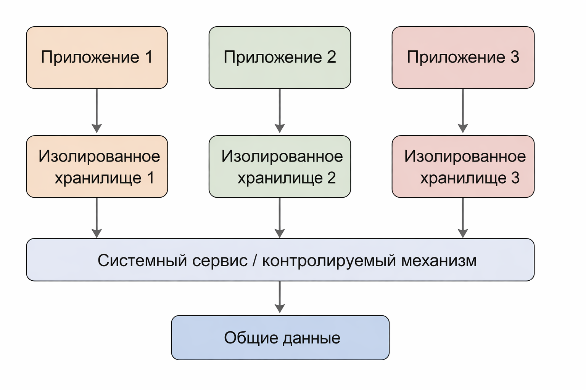

# Докладчик

:::::::::::::: {.columns align=center}
::: {.column width="70%"}

  * Лащиков Алексей Антонович
  * Студент группы НКАбд-04-25
  * Российский университет дружбы народов им. П. Лумумбы
  * [1032253527@rudn.ru](mailto:1032253527@rudn.ru)
  * <https://alexeylashikov.github.io/>

:::
::: {.column width="30%"}

:::
::::::::::::::

# Вводная часть и актуальность темы

Защита файлов --- один из базовых элементов информационной безопасности, поскольку именно файл является основной единицей хранения:

- пользовательских документов;
- системных настроек;
- журналов и служебных данных;
- исполняемых файлов и конфигураций.

**Актуальность темы** определяется тем, что нарушение конфиденциальности, целостности или доступности файлов приводит к утечке данных, сбоям программ и компрометации всей системы.

# Многоуровневая защита файлов

**Основные уровни защиты:**

:::: columns
::: {.column width="50%"}
1. **Аутентификация** --- подтверждение личности пользователя или процесса.
2. **Проверка прав доступа** --- применение DAC, ACL и базовых разрешений.
3. **Обязательные политики** --- SELinux, AppArmor, sandbox и другие ограничения.
:::

::: {.column width="50%"}
4. **Шифрование данных** --- защита содержимого файла без ключа.
5. **Контроль целостности** --- выявление подмены и несанкционированных изменений.
6. **Аудит и журналирование** --- фиксация действий и событий доступа.
:::
::::

**Ключевая идея:** если один уровень не сработал, следующий снижает риск инцидента.

# Контроль доступа к файлам в Linux

**Базовая модель Linux** строится на разграничении прав для трёх категорий:

* **владелец файла**;
* **группа**;
* **остальные пользователи**.

Для каждой категории задаются права:

* **r** --- чтение;
* **w** --- запись;
* **x** --- выполнение.

# Контроль доступа к файлам в Windows

**В Windows** контроль доступа к файлам обычно реализуется через файловую систему **NTFS** и списки контроля доступа **ACL**.

Основу составляют:

* **DACL** --- определяет, кому и что разрешено;
* **SACL** --- задаёт параметры аудита и журналирования.

**Что можно настраивать:**

* чтение файла;
* запись и изменение;
* выполнение;
* удаление;
* наследование прав для папок и вложенных объектов.

# Обязательные ограничения, песочницы и изоляция

:::::::::::::: {.columns align=center}
::: {.column width="32%"}

**Почему одних прав доступа недостаточно?**

Если вредоносный код запускается от имени пользователя, уже имеющего право на файл, обычная DAC-модель не всегда предотвращает злоупотребление.

:::
::: {.column width="68%"}

{width=60%}

:::
::::::::::::::

**Вывод:** обязательные политики ограничивают даже легально запущенный процесс и уменьшают последствия компрометации приложения.

# Шифрование, целостность и подлинность файлов

**Шифрование** защищает данные при краже или утрате носителя:

- **Windows:** BitLocker, EFS;
- **Linux:** LUKS, fscrypt;
- **macOS:** FileVault;
- **Android / iOS:** FBE, Data Protection.

**Контроль целостности и подлинности** обеспечивает:

- обнаружение несанкционированных изменений;
- проверку происхождения исполняемых файлов;
- доверенную загрузку и защиту системных компонентов.

**Практический смысл:** даже если файл перехвачен или скопирован, без ключа его нельзя прочитать, а подмену можно выявить по хешу или подписи.

# Анализ результатов и сравнение ОС

{width=64%}

**Результат анализа:** различия между ОС определяются не наличием одного «лучшего» механизма, а композицией защитных уровней и качеством их настройки.

# Практическая значимость достигнутых результатов

По результатам исследования можно сформулировать прикладные рекомендации:

- не ограничиваться только правами доступа;
- использовать ACL там, где требуется гибкое разграничение;
- включать SELinux / AppArmor / sandbox-механизмы;
- применять шифрование для ноутбуков, мобильных устройств и серверов;
- настраивать аудит доступа к критичным файлам;
- учитывать особенности безопасного удаления данных на SSD и в виртуальных средах.

**Практическая ценность работы** состоит в том, что эти выводы применимы как в учебной среде, так и в корпоративной инфраструктуре.

# Общее заключение и выводы

**Основные выводы:**

- универсального метода защиты файлов не существует;
- базовый уровень составляют права доступа и ACL;
- обязательные политики и песочницы уменьшают ущерб от компрометации процессов;
- шифрование защищает данные при физической утрате носителя;
- контроль целостности и цифровые подписи помогают выявлять подмену;
- аудит и безопасное удаление завершают жизненный цикл защиты данных.

**Итоговый вывод:** надёжная защита файлов обеспечивается только при сочетании нескольких взаимодополняющих механизмов и их корректной настройке.