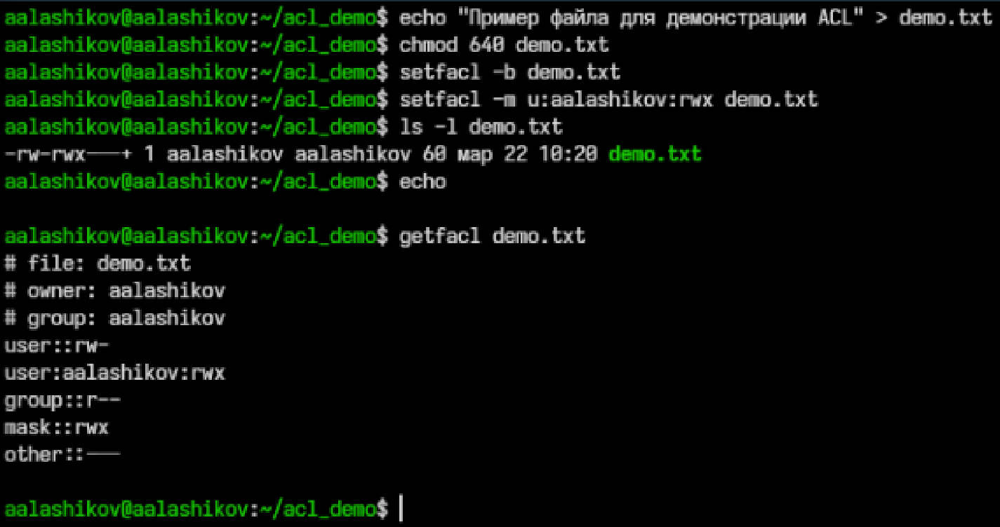
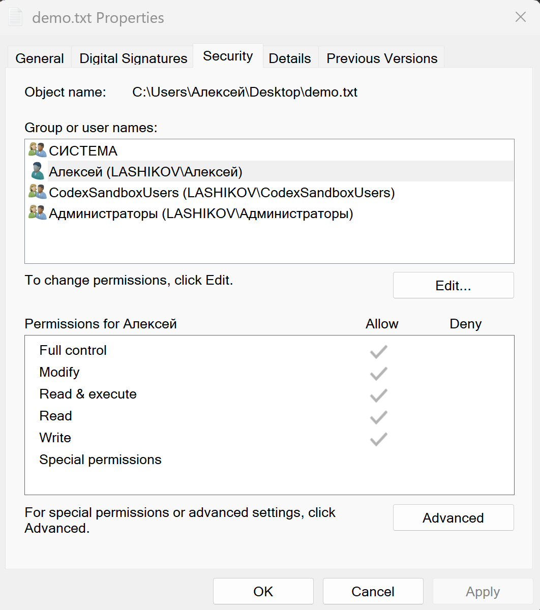

---
## Author
author:
  name: Лащиков Алексей Антонович
  email: "1032253527@rudn.ru"
  affiliation:
    - name: Российский университет дружбы народов
      country: Российская Федерация
      postal-code: 117198
      city: Москва
      address: ул. Миклухо-Маклая, д. 6

## Title
title: "Реферат"
subtitle: "Обзор методов защиты файлов в операционных системах"
license: "CC BY"

toc: true
toc-title: "Содержание"
number-sections: true

crossref:
  fig-title: "Рисунок"
  tbl-title: "Таблица"
  sec-prefix: "Раздел"
  fig-prefix: "Рис."
  tbl-prefix: "Табл."

bibliography: references.bib
link-citations: true

format:
  pdf:
    pdf-engine: xelatex
    documentclass: article
    fontsize: 12pt
    linestretch: 1.2
    geometry: margin=2.5cm
    mainfont: "Times New Roman"
    sansfont: "Arial"
    monofont: "Consolas"
    include-in-header:
      text: |
        \usepackage{polyglossia}
        \setdefaultlanguage{russian}
        \usepackage{csquotes}
        \usepackage{caption}
        \captionsetup[figure]{name=Рисунок}
        \captionsetup[table]{name=Таблица}

  docx:
    toc: true

execute:
  echo: false
  warning: false
  error: false
---

# Введение

Защита файлов в операционных системах является одной из базовых задач информационной безопасности. Именно файл выступает основной единицей хранения пользовательских документов, системных настроек, журналов, программ и служебных данных. Нарушение конфиденциальности, целостности или доступности файлов может привести к утечке информации, искажению данных, нарушению работы программ и компрометации всей системы.

Современные операционные системы не ограничиваются одним средством защиты. На практике используется многоуровневый подход: сначала система определяет пользователя и его полномочия, затем проверяет правила доступа к объекту, при необходимости применяет шифрование, средства контроля целостности, журналирование и механизмы безопасного удаления данных [@nist-dac; @nist-mac; @ms-mic; @nist-sanitization]. Общая логика такого подхода показана на [рис. 1](#fig-layers).

::: {#fig-layers}
```{mermaid}
%%{init: {
  "themeVariables": { "fontSize": "11px" },
  "flowchart": { "nodeSpacing": 15, "rankSpacing": 18 }
}}%%
flowchart TB
    A[Пользователь или процесс] --> B[Аутентификация]
    B --> C[Проверка прав доступа DAC / ACL]
    C --> D[Проверка обязательных политик MAC / sandbox]
    D --> E[Шифрование данных]
    E --> F[Контроль целостности]
    F --> G[Аудит и журналирование]
    G --> H[Безопасное удаление данных]
```

Основные уровни защиты файлов в операционной системе
:::

Цель данного реферата --- рассмотреть основные методы защиты файлов в операционных системах, показать их назначение, достоинства и ограничения, а также сопоставить подходы, применяемые в разных семействах ОС.

# Теоретические основы защиты файлов

## Базовые свойства безопасности

В контексте файловой защиты обычно рассматриваются три классических свойства информации: конфиденциальность, целостность и доступность. Конфиденциальность означает, что данные могут читать только уполномоченные субъекты. Целостность предполагает невозможность незаметного изменения файла или, по крайней мере, возможность обнаружить такое изменение. Доступность означает, что легальный пользователь или сервис может получить доступ к данным тогда, когда это требуется. В нормативной и эксплуатационной документации по защищённым ОС подчёркивается, что политика безопасности должна учитывать не только права пользователя, но и состояние системы, правила разграничения доступа, контроль целостности и регистрацию событий безопасности [@astra-ksz; @astra-mic].

Файловая защита опирается на понятия субъекта и объекта безопасности. Субъектом считается активная сущность, которая инициирует действие, например пользователь или процесс. Объектом выступает то, к чему производится обращение: файл, каталог, устройство или иной ресурс. В UNIX-подобных системах субъектами доступа являются пользователи и процессы, а объектами --- файлы, каталоги и другие сущности файловой системы; именно на этом строятся как дискреционные, так и мандатные механизмы защиты [@astra-dac; @astra-mac].

## Модели управления доступом

В основе большинства средств защиты файлов лежат формальные модели управления доступом. Наиболее известными являются дискреционная модель DAC, мандатная модель MAC, ролевая модель RBAC и атрибутная модель ABAC.

Дискреционное управление доступом, или DAC, предполагает, что субъект, уже имеющий определённые права на объект, в рамках правил системы может передавать их другим субъектам или изменять параметры доступа [@nist-dac]. Такая модель исторически лежит в основе файловых прав UNIX и NTFS ACL в Windows. Её достоинство заключается в простоте и гибкости, однако она сильно зависит от корректности действий владельца объекта.

Мандатное управление доступом, или MAC, строится на централизованной политике, которая применяется ко всем субъектам и объектам единообразно. Решение о доступе определяется не желанием владельца файла, а набором меток и правил безопасности [@nist-mac]. Именно этот подход используется в системах SELinux, AppArmor, Mandatory Integrity Control и ряде песочниц.

RBAC связывает права не напрямую с пользователями, а с ролями. Пользователь получает полномочия в зависимости от роли, которую выполняет в системе: например, администратор, оператор, аудитор или обычный сотрудник [@nist-rbac]. Такая модель особенно удобна в корпоративных инфраструктурах.

ABAC делает решение о доступе ещё более гибким. Оно вычисляется с учётом атрибутов субъекта, объекта, операции и окружения: времени, места, типа устройства или состояния сеанса [@nist-abac]. Хотя в классических настольных ОС ABAC применяется ограниченно, его идеи активно используются в корпоративных системах управления доступом и облачных средах.

На практике операционные системы редко используют только одну модель. Обычно базовые файловые права строятся на DAC, а поверх них добавляются обязательные ограничения MAC, изоляция процессов и правила журналирования. Поэтому защита файла почти всегда является результатом совместной работы нескольких механизмов.

# Контроль доступа к файлам

## Традиционные права доступа и ACL

Самым известным методом защиты файлов являются права доступа. В UNIX-подобных ОС для каждого файла и каталога задаются права чтения, записи и выполнения для владельца, группы владельца и остальных пользователей [@astra-dac]. Такая модель проста и удобна, но её возможностей недостаточно, когда требуется задавать разные комбинации разрешений для большого числа пользователей и групп. Поэтому современные файловые системы дополняют базовые права списками контроля доступа ACL [@astra-acl; @alt-setfacl].

POSIX ACL расширяют традиционную модель и позволяют назначать права конкретным пользователям и группам намного гибче, чем обычная схема owner/group/other [@astra-acl; @alt-setfacl]. При этом важным элементом является маска ACL, ограничивающая эффективные права для именованных записей. Неправильная настройка маски нередко приводит к ситуациям, когда формально право выдано, но фактически не действует [@alt-getfacl; @alt-setfacl].

На [рис. 2](#fig-acl-example) показан пример просмотра стандартных прав доступа и расширенных ACL для файла в Linux.

{#fig-acl-example width=80%}

В Windows аналогичную роль играют ACL файловой системы NTFS. Каждому объекту соответствует дескриптор безопасности, включающий дискреционный список DACL и системный список SACL. DACL определяет, что разрешено и запрещено, а SACL используется для аудита обращений к объекту [@ms-icacls]. Наследование записей доступа от родительских каталогов значительно облегчает администрирование, но одновременно создаёт риск непреднамеренного расширения полномочий, если наследуемые правила настроены слишком широко [@ms-ace-inheritance].

Визуальный пример просмотра и настройки прав доступа к файлу в Windows приведён на [рис. 3](#fig-windows-acl).

{#fig-windows-acl width=78%}

## Обязательные ограничения и песочницы

Одних только файловых прав часто недостаточно. Если вредоносный код запускается от имени пользователя, уже имеющего доступ к документу, обычный DAC не сможет этому помешать. Поэтому в современных ОС применяются обязательные ограничения.

В Windows такой механизм реализован в виде Mandatory Integrity Control. Он дополняет дискреционный доступ и проверяет уровень целостности субъекта и объекта до анализа DACL [@ms-mic]. Это означает, что даже при формально совпадающих правах запись в объект может быть запрещена, если уровень целостности процесса ниже требуемого.

В Linux и ряде UNIX-подобных систем для обязательного контроля применяются SELinux и AppArmor. SELinux использует метки безопасности и политики типа type enforcement, разрешая только те взаимодействия, которые явно предусмотрены политикой [@fedora-selinux]. AppArmor, напротив, ориентируется на профили для конкретных программ и ограничения по файловым путям [@ubuntu-apparmor]. Оба механизма усиливают защиту файлов, так как снижают вероятность злоупотребления правами процесса после компрометации приложения.

В мобильных ОС идея обязательных ограничений выражена ещё сильнее. Android опирается на модель sandbox для приложений, уникальные UID и SELinux в режиме enforcing [@android-sandbox; @android-fbe]. В iOS сторонние приложения работают в изолированных контейнерах и не могут произвольно читать файлы других приложений без посредничества системных сервисов [@apple-platform-security].

Принцип изоляции приложений в мобильных ОС иллюстрирует [рис. 4](#fig-sandbox-mobile).

{#fig-sandbox-mobile width=82%}

## Принятие решения о доступе

На практике доступ к файлу разрешается не одной проверкой, а последовательностью действий. Сначала система сопоставляет пользователя с его учётной записью, затем анализирует обязательные ограничения, потом дискреционные права и, если требуется, записывает событие в журнал. Упрощённая схема показана на [рис. 5](#fig-access-flow).

::: {#fig-access-flow}
```{mermaid}
%%{init: {
  "themeVariables": { "fontSize": "11px" },
  "flowchart": { "nodeSpacing": 15, "rankSpacing": 18 }
}}%%
flowchart TD
    A[Запрос на доступ к файлу] --> B[Определение пользователя и процесса]
    B --> C[Проверка обязательных ограничений]
    C --> D[Проверка дискреционных прав и ACL]
    D --> E{Доступ разрешён?}
    E -- Да --> F[Открытие файла]
    E -- Нет --> G[Отказ в доступе]
    F --> H[Запись события в журнал]
    G --> H
```

Упрощённая схема принятия решения о доступе к файлу
:::

Такая последовательность показывает, почему даже корректно настроенные права владельца не гарантируют полный доступ: итоговое решение зависит и от дополнительных политик безопасности, и от режима аудита, и от состояния сеанса.

# Шифрование как метод защиты файлов

## Назначение шифрования

Шифрование предназначено прежде всего для защиты данных в состоянии хранения, то есть at rest. Если устройство выключено, потеряно или диск извлечён из компьютера, злоумышленник не сможет прочитать содержимое файлов без ключей дешифрования [@windows-encryption; @android-fbe; @apple-filevault]. Однако шифрование не решает всех проблем. Если система уже разблокирована и вредоносный процесс работает от имени пользователя, файл после расшифровки становится доступен в рамках имеющихся полномочий. Следовательно, шифрование необходимо рассматривать как один из слоёв защиты, а не как универсальное средство.

## Полное и файловое шифрование

Существует несколько основных подходов к шифрованию. Полное шифрование диска или устройства защищает целый том и особенно эффективно против кражи носителя. В Windows для этого применяется BitLocker, в macOS --- FileVault, в Linux --- dm-crypt/LUKS [@windows-encryption; @apple-filevault; @linux-fscrypt].

Файловое шифрование работает на уровне отдельных файлов или каталогов. Примером служит EFS в Windows, а также file-based encryption в мобильных системах. Такой подход удобен тем, что разные категории данных могут защищаться разными ключами и разблокироваться независимо [@windows-efs; @android-fbe].

Особое значение файловое шифрование имеет для Android. Официальная документация указывает, что Android 7.0 и выше поддерживает file-based encryption, а для новых устройств на Android 10 и выше именно FBE является обязательной моделью [@android-fbe]. Это связано с тем, что разные файлы и профили пользователя могут разблокироваться отдельно, а часть сервисов остаётся доступной ещё до полного ввода пароля через механизм Direct Boot [@android-fbe].

На [рис. 6](#fig-encryption-example) показан пример экрана восстановления BitLocker в Windows. Такой механизм демонстрирует, что данные на диске хранятся в зашифрованном виде, а доступ к ним возможен только после успешной аутентификации и ввода соответствующего ключа восстановления.

{#fig-encryption-example width=78%}

## Аппаратная поддержка ключей

Эффективность шифрования во многом зависит от того, как именно хранятся и защищаются ключи. Современные ОС всё чаще опираются на аппаратный корень доверия: TPM в персональных компьютерах, Secure Enclave в устройствах Apple, аппаратно защищённый Keystore в Android [@windows-encryption; @android-keystore; @apple-platform-security]. Это усложняет извлечение ключей и повышает устойчивость к атакам на загрузочную цепочку.

# Контроль целостности и аутентичности

## Проверка целостности данных

Защита файлов должна обеспечивать не только запрет чтения, но и обнаружение несанкционированных изменений. Для этого применяются контрольные суммы, хэширование, цифровые подписи и механизмы доверенной загрузки.

На уровне файловых систем важны встроенные средства контроля целостности. Некоторые современные файловые системы используют контрольные суммы для данных и метаданных, что позволяет обнаруживать повреждения и в отдельных случаях автоматически восстанавливать корректную копию из зеркала или другой избыточной структуры [@linux-fscrypt]. Хотя подобные механизмы не всегда подтверждают, кто именно изменил данные, они позволяют вовремя заметить нарушение целостности.

## Подписи и доверие к исполняемым файлам

Для системных и исполняемых файлов большое значение имеют цифровые подписи. В Windows широко используется Authenticode, в macOS --- code signing и notarization, в Android установка приложения без подписи невозможна [@windows-encryption; @apple-platform-security; @android-sandbox]. Подпись помогает убедиться в происхождении файла и в том, что его содержимое не было изменено после подписания.

Целостность тесно связана и с доверенной загрузкой. Если злоумышленник получает возможность подменить загрузчик, драйвер или ядро, то он потенциально обходит и файловые права, и политики MAC. Поэтому механизмы Secure Boot, Measured Boot и аналогичные цепочки доверия играют важную роль в общей защите файлов, особенно системных [@windows-encryption; @apple-platform-security].

# Аудит и журналирование

Даже хорошо настроенные права доступа и шифрование не исключают инциденты. Поэтому важным методом защиты файлов является аудит: система фиксирует факты обращения к объектам, изменения прав, неудачные попытки доступа и иные события безопасности.

В Windows аудит файлового доступа зависит от двух условий: соответствующая политика должна быть включена, и у конкретного объекта должен быть настроен SACL [@ms-icacls]. В Linux ту же задачу решают auditd и правила аудита, позволяющие отслеживать обращения к важным файлам и каталогам [@ubuntu-apparmor]. В результате администратор получает возможность не только заметить подозрительные действия, но и восстановить картину событий после инцидента.

Журналирование особенно важно для критичных системных файлов, конфигураций и секретов. Если доступ к ним был получен правомерно с точки зрения DAC, но необычно с точки зрения поведения пользователя или процесса, именно журнал позволяет обнаружить аномалию. Поэтому аудит нельзя считать второстепенным дополнением: он является самостоятельным уровнем защиты.

# Безопасное удаление и остаточные данные

Обычное удаление файла, как правило, не уничтожает его содержимое немедленно. Чаще всего операционная система лишь помечает соответствующие блоки как свободные, а сами данные ещё некоторое время могут быть восстановлены. Из-за этого в средства защиты файлов включают методы безопасного удаления и санитизации носителей.

Современным ориентиром в этой области является NIST SP 800-88 Rev. 2. Документ выделяет уровни Clear, Purge и Destroy и подчёркивает, что выбор метода зависит от типа носителя и требуемой степени защиты [@nist-sanitization]. Для современных SSD простая многократная перезапись уже не считается универсально надёжным подходом, поскольку контроллер накопителя и механизмы wear leveling не гарантируют перезапись всех физических областей хранения [@nist-sanitization].

Следовательно, безопасное удаление нужно рассматривать не как одну команду, а как совокупность организационных и технических мер. Для жёстких дисков, SSD, мобильных устройств и виртуальных машин методы могут существенно различаться.

# Сравнение подходов в различных операционных системах

Сопоставить рассмотренные методы удобно в обобщённой таблице. В [табл. 1](#tbl-os-compare) показано, какие решения чаще всего используются в разных семействах ОС.

[]{#tbl-os-compare}

| Семейство ОС | Контроль доступа       | Доп. механизмы      | Шифрование      | Краткая характеристика                              |
| ------------ | ---------------------- | ------------------- | --------------- | --------------------------------------------------- |
| Windows      | NTFS DACL/SACL, ACE    | MIC                 | BitLocker, EFS  | Гибкая ACL-модель и развитый аудит                  |
| Linux        | POSIX-права, POSIX ACL | SELinux, AppArmor   | LUKS, fscrypt   | Гибкая настройка, важна корректная конфигурация     |
| macOS        | BSD-права, ACL         | Sandbox, Gatekeeper | FileVault       | Сильная связка доступа, подписи и аппаратной защиты |
| Android      | UID-изоляция, sandbox  | SELinux             | FBE             | Акцент на контейнеризации приложений                |
| iOS/iPadOS   | Контейнеры приложений  | Системная песочница | Data Protection | Закрытая модель с контролируемым доступом           |

: Сравнение основных методов защиты файлов в разных семействах операционных систем

Из [табл. 1](#tbl-os-compare) видно, что различия между системами связаны не столько с наличием или отсутствием конкретных механизмов, сколько с их композицией. Windows делает акцент на развитой ACL-модели и интеграции с корпоративной инфраструктурой. Linux предоставляет очень гибкий набор средств, но требует аккуратного администрирования. Мобильные ОС сильнее опираются на песочницы, аппаратную защиту ключей и строгую изоляцию приложений.

# Проблемы и ограничения существующих методов

Несмотря на большое число средств защиты, на практике уязвимости нередко возникают из-за ошибок конфигурации и человеческого фактора. Слишком широкие наследуемые ACL, отключение SELinux или AppArmor ради совместимости, потеря расширенных атрибутов при копировании файлов, неверно настроенный аудит, хранение ключей восстановления в небезопасном месте --- всё это снижает реальную эффективность защиты [@fedora-selinux; @ubuntu-apparmor; @alt-setfacl].

Кроме того, каждый метод имеет свои ограничения. Права доступа бессильны против администратора или уязвимого ядра. Шифрование бесполезно, если система уже разблокирована и атакующий действует от имени пользователя. Контроль целостности может обнаружить подмену, но не всегда предотвратить её. Аудит полезен для расследования, но не блокирует действие в моменте. Безопасное удаление осложняется особенностями современных носителей и виртуализированных сред [@nist-sanitization].

Именно поэтому в реальных системах важен принцип глубокой обороны: разные методы должны не заменять, а дополнять друг друга.

# Заключение

В ходе рассмотрения темы было установлено, что защита файлов в операционных системах представляет собой комплекс взаимосвязанных методов. Базовым уровнем остаётся управление доступом --- традиционные права, ACL, роли и политики. Дополнительно используются обязательные ограничения и песочницы, которые уменьшают ущерб от компрометации приложений. Шифрование защищает данные при физической утрате носителя, контроль целостности помогает выявлять подмену и повреждение файлов, аудит обеспечивает наблюдаемость, а безопасное удаление уменьшает риск восстановления уже удалённой информации.

Главный вывод состоит в том, что универсального средства защиты файлов не существует. Надёжность обеспечивается только сочетанием нескольких слоёв: корректной аутентификации, разумного разграничения прав, обязательных политик, шифрования, контроля целостности, аудита и продуманной работы с жизненным циклом данных. Для администратора и пользователя это означает, что реальная безопасность зависит не только от наличия функций в ОС, но и от качества их настройки и сопровождения.

# Список литературы